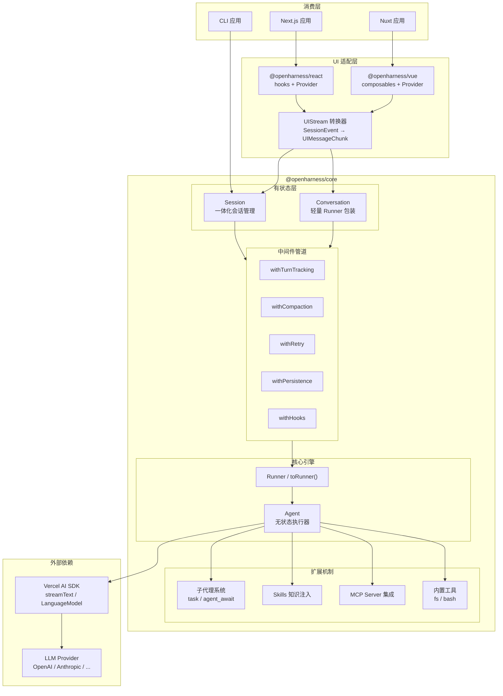
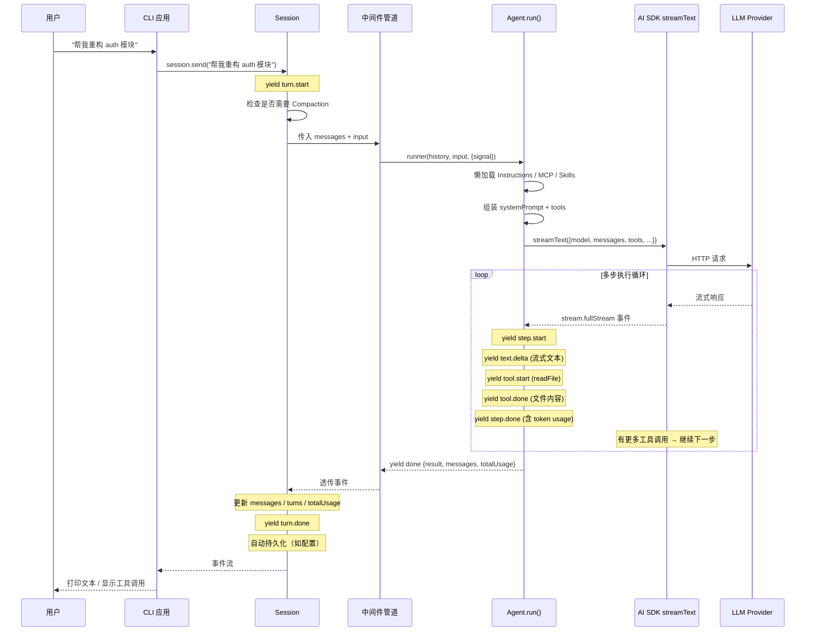
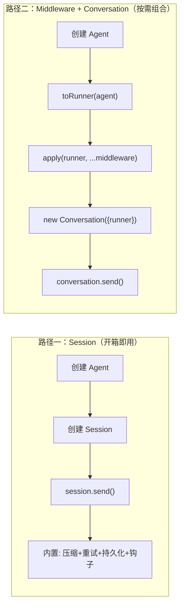

# 第一章 序言：全局视角

> **读完本章你将获得：** 对 OpenHarness 整体架构的完整心智模型——知道它解决什么问题、由哪些模块构成、核心概念之间如何关联，以及一次典型交互从输入到输出的完整路径。

---

## 1.1 项目定位与设计哲学

### 它是什么

OpenHarness 是一个基于 Vercel AI SDK 的**通用代理构建框架**。它把构建一个功能完整的 AI Agent 所需的能力——多步执行循环、工具调用、子代理委派、上下文压缩、重试容错、会话持久化、UI 实时流式推送——拆解为可组合的构建块。

### 它解决什么问题

Claude Code、Codex、OpenCode 等 Agent Harness 功能强大，但它们是"重量级"的完整应用。想在自己的代码中以编程方式使用类似能力？OpenHarness 把这些能力提炼为库级别的 API。

### 三条核心设计原则

| 原则 | 含义 | 体现 |
|------|------|------|
| **Agent 无状态** | Agent 不持有消息历史，每次 `run()` 传入历史、传出新历史 | 调用者完全掌控对话状态 |
| **中间件函数式组合** | 横切关注点（重试、压缩、持久化…）不硬编码进 Agent | `Runner → Middleware → Runner` 的管道模式 |
| **事件流驱动** | 所有操作通过 `AsyncGenerator<AgentEvent>` 产出事件 | 上层（CLI / Web UI）统一消费同一套事件协议 |

---

## 1.2 架构全景图



**一句话读图：** 消费层（CLI / Web）→ UI 适配层（React / Vue hooks）→ 有状态层（Session / Conversation）→ 中间件管道 → 无状态 Agent → Vercel AI SDK → LLM Provider。

---

## 1.3 核心概念词典

### 概念总览图

```mermaid
classDiagram
    class Agent {
        +name: string
        +model: LanguageModel
        +tools: ToolSet
        +run(history, input) AsyncGenerator~AgentEvent~
        无状态执行器
    }

    class Session {
        +messages: ModelMessage[]
        +turns: number
        +send(input) AsyncGenerator~SessionEvent~
        有状态会话管理
    }

    class Conversation {
        +messages: ModelMessage[]
        +runner: Runner
        +send(input) AsyncGenerator~AgentEvent~
        轻量Runner包装
    }

    class Runner {
        <<function type>>
        (history, input, options) → AsyncGenerator~AgentEvent~
    }

    class Middleware {
        <<function type>>
        (Runner) → Runner
    }

    Session --> Agent : 内部持有
    Conversation --> Runner : 内部持有
    Agent ..|> Runner : toRunner() 适配
    Middleware --> Runner : 变换

    class AgentEvent {
        <<discriminated union>>
        text.delta | tool.start | done | ...
    }

    class SessionEvent {
        <<superset>>
        AgentEvent + turn/compaction/retry 事件
    }

    Agent --> AgentEvent : yields
    Session --> SessionEvent : yields
```

### 逐个解释

#### Agent（无状态代理执行器）

Agent 是整个系统的核心原语。它封装了 LLM 模型、工具集、系统提示和多步执行循环。关键特征是**无状态**——它不保存消息历史。每次调用 `run(history, input)` 时传入完整历史，执行完通过 `done` 事件返回更新后的历史。

#### Session（有状态会话管理器）

Session 在 Agent 之上添加**状态和弹性**。它持有 `messages` 数组，自动处理上下文压缩（Compaction）、重试（Retry）、持久化（Persistence）和生命周期钩子（Hooks）。适合需要"开箱即用"的场景。

#### Runner（运行器函数）

与 `Agent.run()` 签名完全相同的异步生成器函数：

```typescript
type Runner = (
  history: ModelMessage[],
  input: string | ModelMessage[],
  options?: { signal?: AbortSignal },
) => AsyncGenerator<AgentEvent>;
```

`toRunner(agent)` 把 Agent 实例适配为 Runner，进入中间件管道。

#### Middleware（中间件）

`Runner → Runner` 的高阶函数。每个中间件在 Runner 的输入或输出上添加一层行为（重试、压缩、持久化…）。通过 `apply()` 或 `pipe()` 组合：

```
apply(toRunner(agent), withTurnTracking(), withCompaction(...), withRetry())
```

#### Conversation（轻量有状态包装）

Session 的"解构版"。不使用 Session 的一体化设计，而是直接包装一个已组合的 Runner。自身只负责维护 `messages` 数组——压缩、重试等功能通过中间件注入。

#### Compaction（上下文压缩）

当对话长度逼近模型上下文窗口时触发的消息历史压缩。默认策略分两阶段：
1. **Pruning（剪枝）**——把旧消息中的工具返回值替换为 `"[pruned]"`，无需 LLM 调用
2. **Summarization（摘要）**——剪枝不够时，调用 LLM 生成结构化摘要替换整段历史

#### AgentEvent（代理事件）

Agent.run() 产出的类型判别联合（Discriminated Union）：

| 事件类型 | 含义 |
|---------|------|
| `text.delta` / `text.done` | 模型流式文本 |
| `reasoning.delta` / `reasoning.done` | 模型思维链（如支持） |
| `tool.start` / `tool.done` / `tool.error` | 工具调用生命周期 |
| `step.start` / `step.done` | 多步执行的步骤边界 |
| `error` | 运行时错误 |
| `done` | 执行结束，携带 result / messages / totalUsage |

#### SessionEvent（会话事件）

AgentEvent 的超集，额外包含：

| 事件类型 | 含义 |
|---------|------|
| `turn.start` / `turn.done` | 对话轮次边界 |
| `compaction.start` / `compaction.pruned` / `compaction.summary` / `compaction.done` | 压缩生命周期 |
| `retry` | 重试通知（含延迟和错误） |

#### Subagent（子代理）

父 Agent 通过自动生成的 `task` 工具将任务委派给子 Agent。每次委派创建全新实例，无共享状态。支持深度递减控制和后台并发执行。

#### Skill（技能）

按需注入到 LLM 对话中的 Markdown 知识包。包含一个 `SKILL.md`（带 YAML frontmatter）和可选辅助文件。模型通过自动生成的 `skill` 工具加载。

---

## 1.4 代码库地图

```
openharness/
├── packages/
│   ├── core/                          ← 核心库：Agent、Session、中间件、工具
│   │   └── src/
│   │       ├── agent.ts               ← Agent 类 + 事件类型 + 子代理工具生成
│   │       ├── session.ts             ← Session + DefaultCompactionStrategy
│   │       ├── conversation.ts        ← Conversation 轻量包装
│   │       ├── runner.ts              ← Runner/Middleware 类型 + pipe/apply
│   │       ├── stream.ts              ← 流组合器：tap / filter / map / takeUntil
│   │       ├── ui-stream.ts           ← SessionEvent → AI SDK 5 UIMessageChunk 转换
│   │       ├── messages.ts            ← extractUserInput() UI 消息解析
│   │       ├── instructions.ts        ← AGENTS.md / CLAUDE.md 加载
│   │       ├── mcp.ts                 ← MCP Server 连接管理
│   │       ├── skills.ts              ← Skill 发现与 tool 创建
│   │       ├── agent-registry.ts      ← 后台子代理注册表 (AgentRegistry)
│   │       ├── utils.ts               ← 重试判断、退避计算、token 估算
│   │       ├── middleware/
│   │       │   ├── retry.ts           ← withRetry
│   │       │   ├── compaction.ts      ← withCompaction
│   │       │   ├── turn-tracking.ts   ← withTurnTracking
│   │       │   ├── persistence.ts     ← withPersistence
│   │       │   └── hooks.ts           ← withHooks
│   │       ├── tools/
│   │       │   ├── fs.ts              ← 文件系统工具（6 个）
│   │       │   ├── bash.ts            ← bash 工具
│   │       │   └── skill.ts           ← createSkillTool()
│   │       └── types/
│   │           ├── ui-message.ts      ← OHDataTypes / OHMetadata / OHUIMessage
│   │           └── stream-parts.ts    ← SSE 格式化器 + 数据部件类型守卫
│   │
│   ├── react/                         ← React 适配层
│   │   └── src/
│   │       ├── provider.tsx           ← OpenHarnessProvider (React Context)
│   │       ├── context.ts             ← 上下文类型定义
│   │       ├── transport.ts           ← SSE 传输适配
│   │       └── hooks/
│   │           ├── use-open-harness.ts     ← useOpenHarness() 主 hook
│   │           ├── use-subagent-status.ts  ← useSubagentStatus()
│   │           ├── use-session-status.ts   ← useSessionStatus()
│   │           └── use-sandbox-status.ts   ← useSandboxStatus()
│   │
│   └── vue/                           ← Vue 3 适配层
│       └── src/
│           ├── provider.ts            ← OpenHarnessProvider (provide/inject)
│           ├── context.ts             ← 注入 Key + 类型
│           ├── transport.ts           ← SSE 传输适配
│           └── composables/
│               ├── useOpenHarness.ts       ← 主 composable
│               ├── useSubagentStatus.ts
│               ├── useSessionStatus.ts
│               └── useSandboxStatus.ts
│
└── examples/
    ├── cli/cli.ts                     ← CLI 交互示例（中间件组合 + 工具审批）
    ├── nextjs-demo/                   ← Next.js 全栈示例
    │   ├── app/api/chat/route.ts      ← 服务端：Conversation + toResponse()
    │   └── app/components/            ← 客户端：useOpenHarness() + 消息渲染
    └── nuxt-demo/                     ← Nuxt 4 全栈示例
        ├── server/api/chat.post.ts    ← 服务端
        └── app/components/            ← 客户端：Vue composables
```

---

## 1.5 一次典型交互的极简全流程

以 CLI 示例中用户输入"帮我重构 auth 模块"为例，追踪从输入到输出的完整路径：



**流程要点：**

1. **Session 是入口**——用户调用 `session.send()`，而非直接调用 `agent.run()`
2. **中间件是透明的**——压缩、重试、持久化在事件流经过时"自动发生"
3. **Agent 是无状态循环**——接收 history + input，通过 AI SDK 与 LLM 交互，产出事件流
4. **事件协议是统一的**——无论 CLI 还是 Web UI，消费的都是同一套 `AgentEvent` / `SessionEvent`

---

## 1.6 两条 API 路径

OpenHarness 提供两种使用方式，满足不同控制需求：



| 对比 | Session | Middleware + Conversation |
|------|---------|--------------------------|
| 控制粒度 | 通过配置参数调节 | 自由选择和排序中间件 |
| 适合场景 | 快速上手、标准用法 | 需要自定义行为、只需部分功能 |
| 代码量 | 少 | 稍多，但更灵活 |
| 扩展性 | 通过 hooks | 通过自定义 Middleware |

---

### 质检报告

**完整性**
- [x] 项目定位、设计哲学已覆盖
- [x] 架构全景图包含所有层级
- [x] 核心概念词典覆盖全部关键概念并配图
- [x] 代码库地图覆盖全部顶层目录和关键文件
- [x] 典型交互全流程有完整时序图

**准确性**
- [x] 文件路径与仓库一致
- [x] 类型定义与源码一致（AgentEvent、Runner、Middleware 等）
- [x] 事件类型列表完整

**可读性**
- [x] 从"是什么"→"全景图"→"概念词典"→"代码地图"→"典型流程"递进清晰
- [x] 术语首次出现均有解释
- [x] 无前序概念未讲清就被引用

**勘误建议**
- 无
