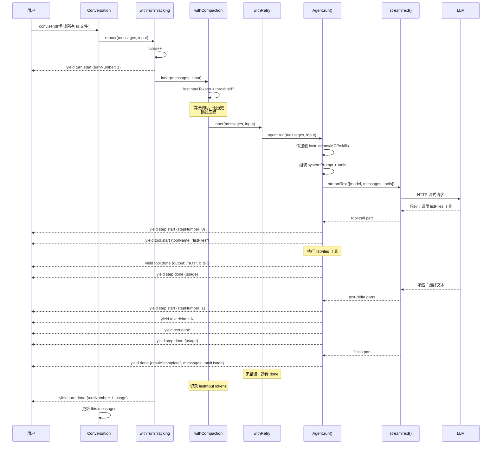
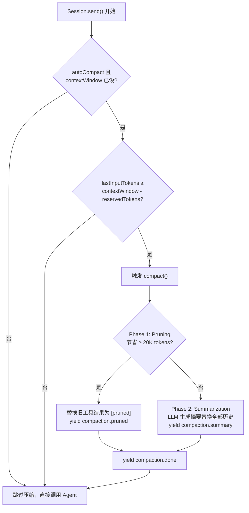
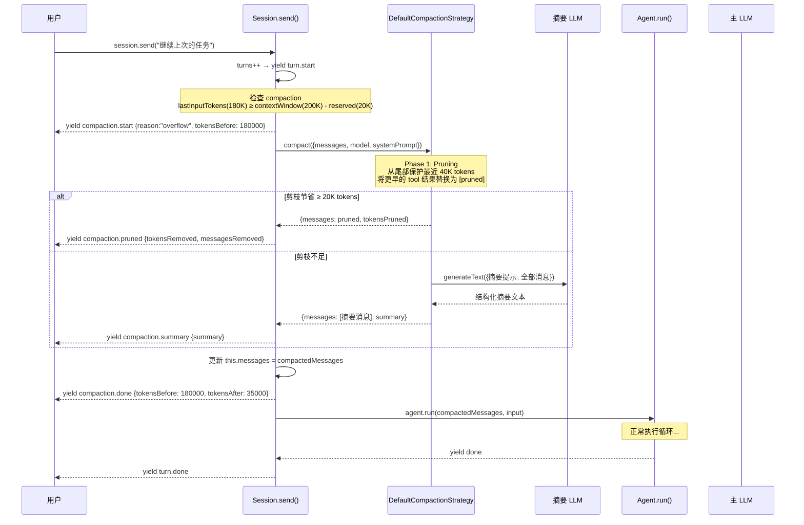
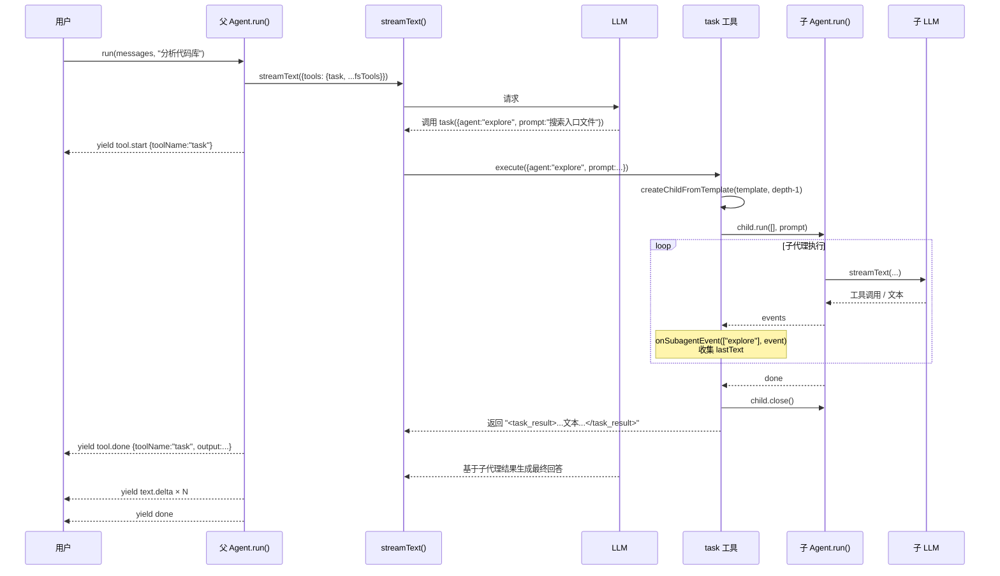
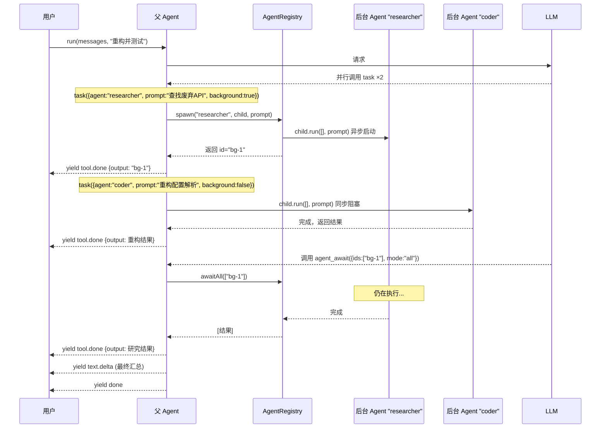
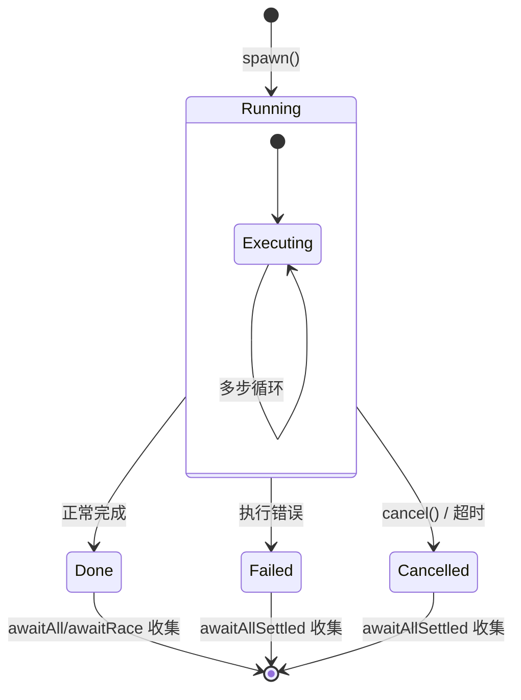
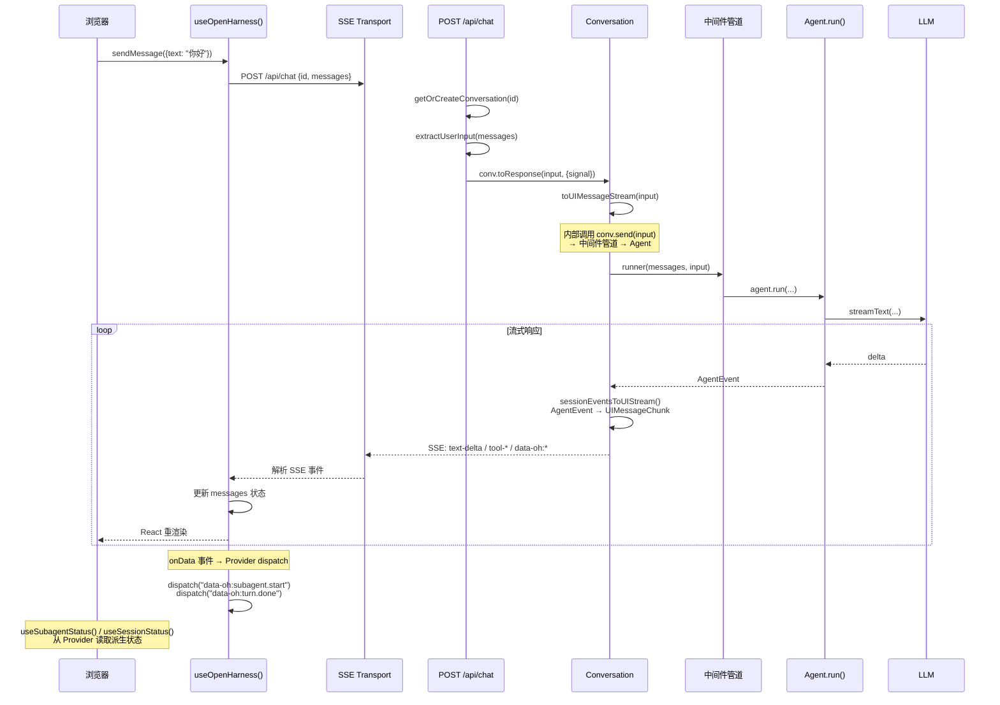
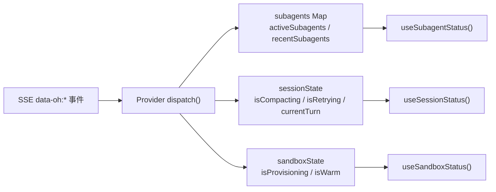

# 第二章 数据流全景

> **读完本章你将获得：** 对 OpenHarness 五大典型场景的完整数据流转理解——从用户输入到最终输出，每一步经过什么模块、数据如何变换、事件如何流动。

---

## 2.1 场景一：CLI 单轮对话（最简路径）

这是最基本的数据流——用户在 CLI 输入一条指令，Agent 调用工具完成任务后返回结果。



**关键调用路径：**
```
Conversation.send()
  → withTurnTracking()(runner)  → yield turn.start
    → withCompaction()(runner)  → 检查 threshold → 跳过
      → withRetry()(runner)    → hasYieldedContent=false
        → Agent.run()
          → streamText()       → LLM HTTP 请求
          → yield step/tool/text/done events
      → 无错误 → 透传
    → 记录 lastInputTokens
  → yield turn.done
→ 更新 messages
```

---

## 2.2 场景二：带 Compaction 的长对话

当对话历史逼近上下文窗口上限时，Compaction 自动触发。这是 Session 的核心增值能力。

### 触发条件



### 完整时序



### Compaction 两阶段策略详解

| 阶段 | 触发条件 | 操作 | 成本 | 默认参数 |
|------|---------|------|------|---------|
| **Phase 1: Pruning** | 总是先尝试 | 从尾部保留 `protectedTokens`，将更早的 tool result 替换为 `"[pruned]"` | 零 LLM 调用 | protectedTokens: 40,000 |
| **Phase 2: Summarization** | Pruning 节省 < `minPruneSavings` | 调用 LLM 生成结构化摘要替换整段历史 | 一次 LLM 调用 | minPruneSavings: 20,000 |

---

## 2.3 场景三：子代理委派（前台同步）

父 Agent 通过自动生成的 `task` 工具把任务分配给子 Agent。前台模式下父 Agent 阻塞等待子 Agent 完成。



**关键设计：**
- 子 Agent 创建时 `maxSubagentDepth` 递减 → 防止无限嵌套
- 子 Agent **不继承** `approve` 回调 → 自主执行，不提示用户确认
- 每次 task 调用创建全新 Agent 实例 → 无共享对话状态
- `onSubagentEvent` 回调携带祖先链 `path: string[]`（如 `["explore"]` 或 `["explore", "search"]`）

---

## 2.4 场景四：后台子代理编排

启用 `subagentBackground` 后，父 Agent 可以并发启动多个后台子代理，继续执行其他工作，最后收集结果。



### 后台子代理生命周期工具



| 工具 | 作用 | 阻塞？ |
|------|------|--------|
| `task` (background:true) | 启动后台 Agent，返回 ID | 否 |
| `agent_status` | 查询 Agent 状态 | 否 |
| `agent_cancel` | 取消运行中的 Agent | 否 |
| `agent_await` | 等待 Agent 完成 | 是 |

`agent_await` 的四种模式对应 JavaScript Promise 组合器：

| 模式 | 语义 | 失败行为 |
|------|------|---------|
| `all` | 全部成功才返回 | 任一失败立即失败 |
| `allSettled` | 全部结束就返回 | 收集成功和失败 |
| `any` | 首个成功就返回 | 全部失败才失败 |
| `race` | 首个结束就返回 | 第一个出结果（含失败） |

---

## 2.5 场景五：Web UI 全链路（Next.js）

这是最复杂的端到端场景——浏览器用户输入，经过 React hooks、SSE 传输、服务端 Conversation、中间件管道、Agent 执行，最终流式推送回浏览器。



### 事件转换链

```
Agent.run() → AgentEvent → sessionEventsToUIStream() → UIMessageChunk → SSE 编码 → HTTP Response
```

核心转换发生在 `sessionEventsToUIStream()`（`ui-stream.ts`），它把 OpenHarness 内部事件协议翻译为 AI SDK 5 的 UIMessage 流协议：

| 内部事件 | SSE 输出 | 用途 |
|---------|---------|------|
| `text.delta` | `text-start` + `text-delta` | 文本流式推送 |
| `reasoning.delta` | `reasoning-start` + `reasoning-delta` | 思维链推送 |
| `tool.start` | `tool-input-start` + `tool-input-available` | 工具调用可视化 |
| `tool.done` | `tool-output-available` | 工具结果展示 |
| `turn.start` | `data-oh:turn.start` | 轮次追踪 |
| `compaction.start/done` | `data-oh:compaction.start/done` | 压缩状态指示 |
| `retry` | `data-oh:retry` | 重试状态指示 |
| subagent 相关 | `data-oh:subagent.*` | 子代理活动追踪 |

### 客户端 Provider 状态派发

浏览器端的 `OpenHarnessProvider` 接收 SSE 自定义数据部件（`data-oh:*`），通过 dispatch 函数更新三类共享状态：



---

## 2.6 数据流要点总结

| 维度 | 设计选择 | 原因 |
|------|---------|------|
| 事件粒度 | 细粒度 discriminated union | 消费者可精确选择关心的事件类型 |
| 消息所有权 | Agent 不持有，Session/Conversation 持有 | 调用者掌控状态，支持任意持久化策略 |
| 中间件顺序 | 列在前面的包裹在外层 | 外层先执行前置逻辑（turn tracking）、内层靠近 Agent（persistence） |
| Compaction 时机 | `send()` 开头、Agent 执行前 | 先压缩再请求 LLM，避免超限 |
| Retry 条件 | 仅在"无内容产出"时重试 | 一旦开始产出（text/tool），重试可能导致重复操作 |
| UI 流转换 | 单一 `sessionEventsToUIStream()` 函数 | 所有 SSE 编码逻辑集中一处，React/Vue 共享 |

---

### 质检报告

**完整性**
- [x] 覆盖五大核心场景：单轮对话、长对话压缩、前台子代理、后台子代理编排、Web UI 全链路
- [x] 每个场景有文字说明 + Mermaid 图 + 关键调用路径
- [x] Compaction 两阶段策略有独立详解
- [x] 后台子代理生命周期和 await 模式有完整覆盖

**准确性**
- [x] 事件类型、中间件顺序与源码一致
- [x] Compaction 触发条件公式与 session.ts 一致
- [x] Retry 决策逻辑（"无内容产出"规则）与源码一致

**可读性**
- [x] 从简单（单轮）到复杂（Web 全链路）递进
- [x] 每个场景自包含，可独立阅读
- [x] 术语引用 Ch1 已建立的定义

**勘误建议**
- 无
