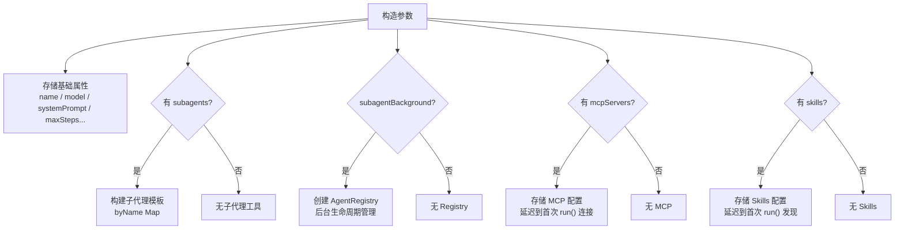
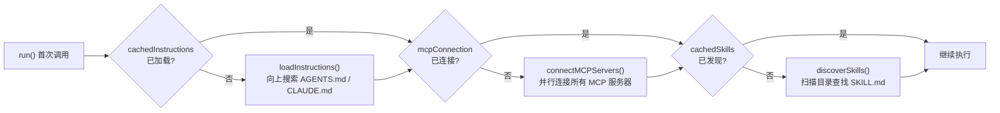
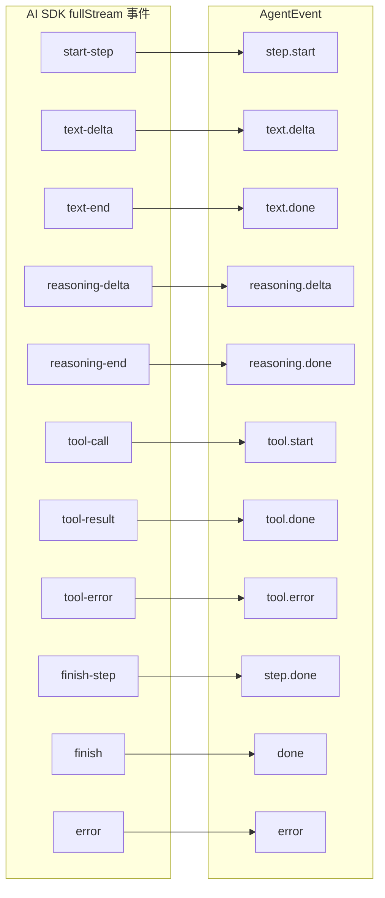
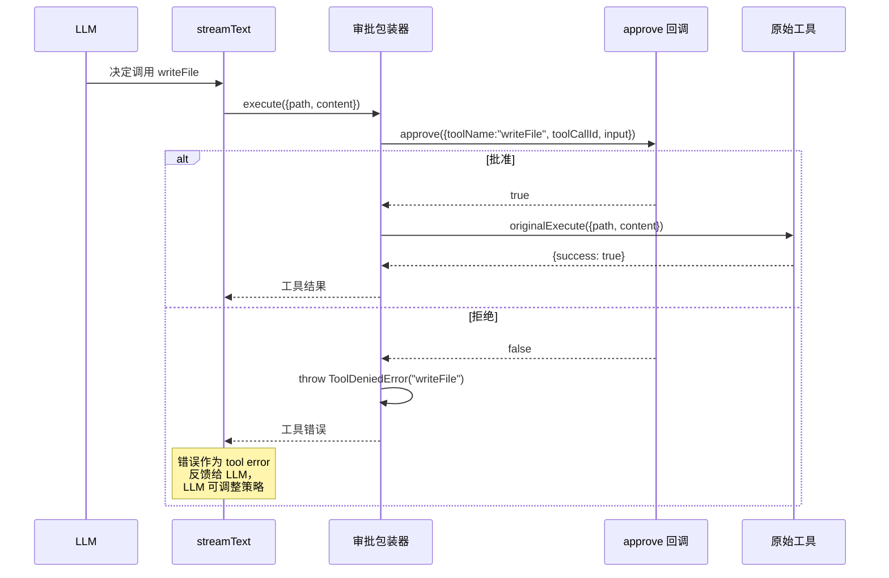
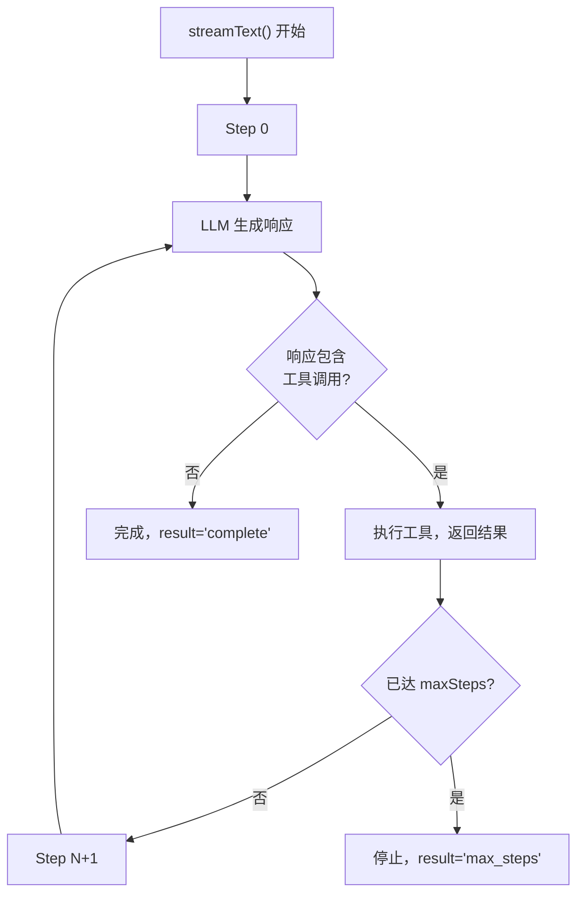

# 第三章 Agent 核心引擎

> **读完本章你将获得：** 对 Agent 类内部实现的完整理解——它的构造过程、run() 方法的逐步执行逻辑、懒初始化策略、工具审批装饰器模式，以及事件流如何从 AI SDK 映射到 AgentEvent。

---

## 3.1 Agent 是什么

Agent 是 OpenHarness 的核心原语——一个**无状态多步执行器**。它封装了：

- 一个 LLM 模型（任何 Vercel AI SDK `LanguageModel`）
- 一组工具（AI SDK `ToolSet`）
- 一个系统提示
- 执行配置（最大步数、温度等）

关键设计：Agent 不持有消息历史。每次 `run()` 传入完整历史，执行完通过 `done` 事件返回更新后的历史。这使得调用者完全掌控对话状态。

---

## 3.2 构造过程



### 构造参数速查

| 参数 | 必需 | 默认值 | 用途 |
|------|------|--------|------|
| `name` | ✅ | — | Agent 名称，用于日志和子代理选择 |
| `model` | ✅ | — | Vercel AI SDK LanguageModel |
| `systemPrompt` | — | — | 系统提示，拼接到每次请求 |
| `tools` | — | — | AI SDK ToolSet |
| `maxSteps` | — | `100` | 最大多步执行次数 |
| `temperature` | — | — | 采样温度 |
| `maxTokens` | — | — | 每步最大输出 token |
| `instructions` | — | `true` | 是否加载 AGENTS.md / CLAUDE.md |
| `approve` | — | — | 工具调用审批回调 |
| `subagents` | — | — | 子 Agent 数组 |
| `maxSubagentDepth` | — | `1` | 子代理嵌套深度 |
| `onSubagentEvent` | — | — | 子代理事件回调 |
| `subagentBackground` | — | — | 后台子代理配置 |
| `mcpServers` | — | — | MCP 服务器配置 |
| `skills` | — | — | Skills 配置 |

---

## 3.3 run() 方法：逐步执行解析

`run()` 是一个 `async function*`（异步生成器），返回 `AsyncGenerator<AgentEvent>`。以下是它的完整执行流程：

### 阶段一：消息准备

```
Agent.run(history, input, options)
  1. messages = [...history]              // 复制，不修改原数组
  2. 追加 input 到 messages：
     - string → 追加为 {role:"user", content: input}
     - ModelMessage[] → 追加全部
```

### 阶段二：懒初始化



三项资源（Instructions、MCP、Skills）都在**首次 run() 时懒加载**，之后缓存复用。设计原因：
- 构造 Agent 时可能尚未确定运行环境（如 cwd）
- MCP 连接可能耗时
- 避免未使用的 Agent 浪费资源

### 阶段三：系统提示与工具组装

```
3. systemPrompt = [this.systemPrompt, cachedInstructions].filter(Boolean).join("\n\n")
4. 工具合并顺序：Skills tool → MCP tools → 静态 tools
5. 如果有 approve 回调：wrapToolsWithApproval(tools, approve)
6. 如果有子代理：注入 task / agent_await / agent_status / agent_cancel 工具
```

工具合并优先级：后添加的覆盖同名工具。

### 阶段四：调用 AI SDK streamText

```typescript
const stream = streamText({
  model: this.model,
  system: systemPrompt,
  messages,
  tools: mergedTools || undefined,
  stopWhen: numberOfSteps({ maxSteps: this.maxSteps }),
  temperature: this.temperature,
  maxOutputTokens: this.maxTokens,
  abortSignal: options?.signal,
});
```

### 阶段五：事件流映射

`run()` 遍历 `stream.fullStream` 产出的 AI SDK 原始事件，逐个映射为 `AgentEvent`：



映射过程中维护两个累积变量：
- `stepText` — 当前步骤已累积的文本（`text.delta` 追加，`text-end` 时用于 `text.done`）
- `stepReasoning` — 当前步骤已累积的推理文本（同理）

### 阶段六：完成与错误处理

```
finish 事件处理：
  1. 将响应消息追加到 messages
  2. 根据 finishReason 映射 result：
     - "stop" → "complete"
     - "tool-calls" → "stopped"（被工具调用中断，但 maxSteps 耗尽）
     - 其他 → 对应状态
  3. yield done {result, messages, totalUsage}

异常处理：
  1. catch 任何抛出的异常
  2. yield error {error}
  3. yield done {result: "error", messages, totalUsage}
```

---

## 3.4 工具审批（Approval）机制



实现方式：`wrapToolsWithApproval()` 遍历所有工具，为每个工具的 `execute` 函数套一层包装器。包装器在执行前调用 `approve()` 回调，如果返回 `false`，抛出 `ToolDeniedError`。

**关键设计：**
- 审批回调是 `async`——可以等待用户 CLI 输入、弹出 Web 确认框或调用外部审批服务
- 被拒绝的工具调用以错误形式反馈给 LLM，LLM 会据此调整后续策略
- 子代理**不继承** `approve` 回调——它们自主执行

---

## 3.5 多步执行循环

Agent 的核心能力是**多步执行**——LLM 可以在一轮对话中多次调用工具，每次工具返回结果后 LLM 继续推理。



每个 Step 产生的事件序列：
```
step.start → [text.delta × N] → [text.done] → [tool.start → tool.done] × N → step.done
```

注意：一个 Step 中可以有多个并行的工具调用——LLM 可以在同一响应中请求多个工具。

---

## 3.6 AgentEvent 类型详解

```typescript
type AgentEvent =
  | { type: "text.delta"; text: string }
  | { type: "text.done"; text: string }
  | { type: "reasoning.delta"; text: string }
  | { type: "reasoning.done"; text: string }
  | { type: "tool.start"; toolCallId: string; toolName: string; input: unknown }
  | { type: "tool.done"; toolCallId: string; toolName: string; output: unknown }
  | { type: "tool.error"; toolCallId: string; toolName: string; error: string }
  | { type: "step.start"; stepNumber: number }
  | { type: "step.done"; stepNumber: number; usage: TokenUsage; finishReason: string }
  | { type: "error"; error: Error }
  | { type: "done"; result: "complete"|"stopped"|"max_steps"|"error";
      messages: ModelMessage[]; totalUsage: TokenUsage }
```

| 事件 | 生命周期 | 携带信息 |
|------|---------|---------|
| `step.start/done` | 包裹一个完整的 LLM 调用步骤 | stepNumber, usage, finishReason |
| `text.delta/done` | 模型文本流 | 增量/完整文本 |
| `reasoning.delta/done` | 扩展思维链（Claude 等模型） | 增量/完整推理文本 |
| `tool.start/done/error` | 工具执行生命周期 | toolCallId, toolName, input/output/error |
| `error` | 运行时异常 | Error 对象 |
| `done` | 终结事件（**保证最后产出**） | result 状态 + 最终 messages + 总 usage |

`done` 事件是**终结事件**——无论成功还是失败，`run()` 保证最后产出一个 `done`。消费者可以依赖它来做收尾工作。

---

## 3.7 close() 与资源清理

```typescript
async close(): Promise<void> {
  // 1. 取消所有后台子代理
  this.agentRegistry?.cancelAll();
  // 2. 关闭所有 MCP 连接
  await closeMCPClients(this.mcpConnection?.clients);
}
```

调用时机：
- CLI 应用退出时
- Web 请求结束后（如果 Agent 非共享）
- Session/Conversation 不再使用时

---

### 质检报告

**完整性**
- [x] Agent 构造过程完整覆盖
- [x] run() 六个阶段逐步解析
- [x] 懒初始化三项资源有图解
- [x] 工具审批机制有时序图
- [x] 多步执行循环有流程图
- [x] AgentEvent 全类型解释
- [x] close() 清理逻辑

**准确性**
- [x] 类型定义与 agent.ts 源码一致
- [x] 懒加载顺序（Instructions → MCP → Skills）与源码一致
- [x] 工具合并顺序与源码一致

**可读性**
- [x] 从"是什么"→"构造"→"执行"→"审批"→"循环"→"事件"→"清理"递进
- [x] 每个概念首次出现有解释
- [x] 引用 Ch1 已建立的术语

**勘误建议**
- 无
