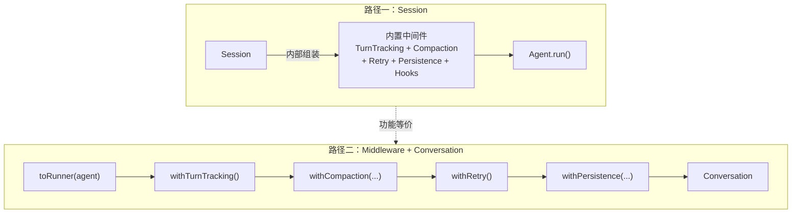
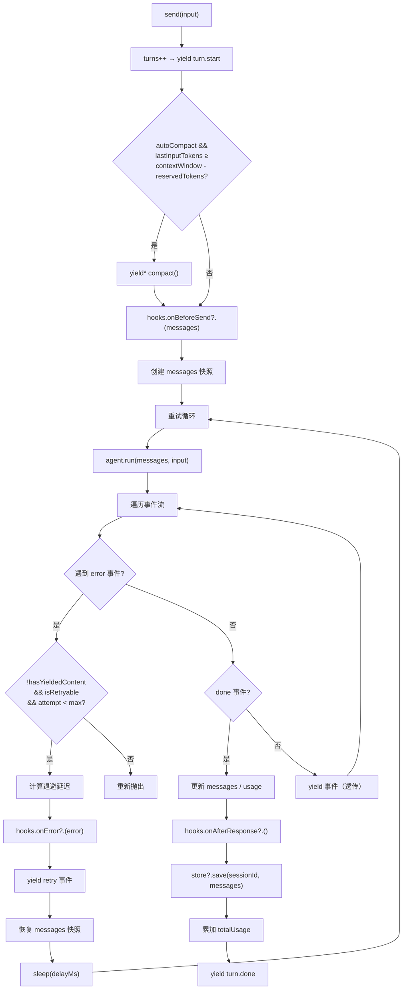
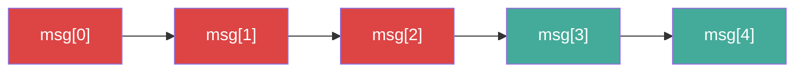
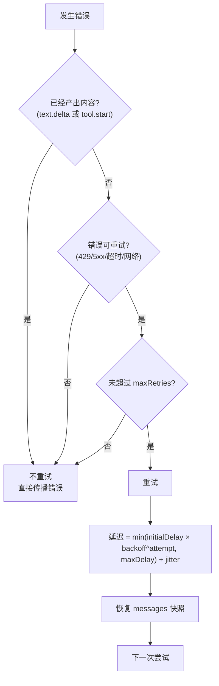
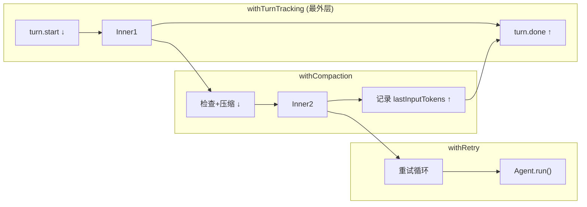
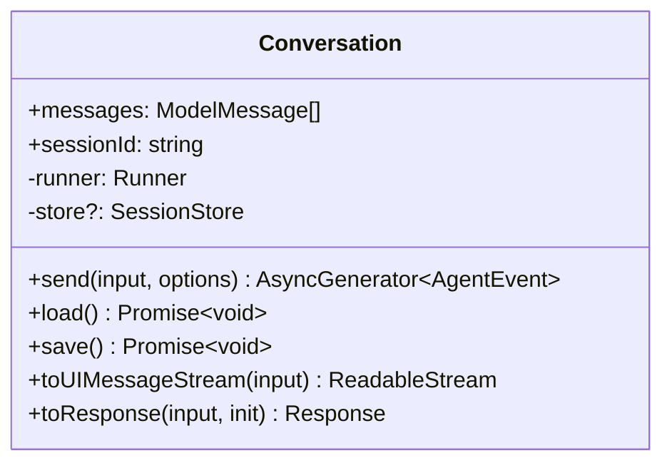

# 第四章 Session 与中间件体系

> **读完本章你将获得：** 对 OpenHarness 两层状态管理（Session 一体化 vs Middleware + Conversation 按需组合）的完整理解，包括 Compaction 策略实现、Retry 退避逻辑、Runner/Middleware 函数式组合模式、流组合器，以及如何自定义中间件。

---

## 4.1 两条路径，同一目标

Ch1 提到 OpenHarness 提供两种使用方式。本章深入讲解它们的内部实现：



Session 和 Middleware + Conversation 产生的事件流功能等价。Session 是"预组装好的中间件管道"，Conversation 是"你自己组装的管道"。

---

## 4.2 Session 详解

### Session 持有的状态

| 属性 | 类型 | 用途 |
|------|------|------|
| `messages` | `ModelMessage[]` | 可读写的消息历史 |
| `turns` | `number` | 已完成的对话轮数 |
| `totalUsage` | `TokenUsage` | 累积 token 用量 |
| `sessionId` | `string` | 会话标识符（自动 UUID 或手动指定） |

### send() 执行流程



### Compaction 策略实现

Session 内部持有一个 `CompactionStrategy` 实例。默认实现 `DefaultCompactionStrategy` 分两阶段：

#### Phase 1: Pruning（剪枝）



从消息尾部向前累积 token 计数。当累积达到 `protectedTokens`（默认 40,000）时设置保护边界。边界之前的 tool 类型消息，其结果内容替换为 `"[pruned]"`。

- **优点：** 零 LLM 调用，极快
- **条件：** 仅当节省 ≥ `minPruneSavings`（默认 20,000 tokens）时才接受

#### Phase 2: Summarization（摘要）

当 Pruning 节省不足时，调用 LLM（可配置独立的低成本模型）生成结构化摘要：

```
输入: 全部消息历史
系统提示: DEFAULT_SUMMARY_PROMPT（或 hooks.onCompaction 自定义）
输出: 摘要文本 → 包装为单条消息替换全部历史
```

替换后的消息格式：
```
[Previous conversation summary]
{摘要内容}
[The conversation continues from here]
```

### Retry 退避逻辑



退避参数默认值：

| 参数 | 默认值 | 含义 |
|------|--------|------|
| `maxRetries` | `3` | 最大重试次数 |
| `initialDelayMs` | `1,000` | 首次延迟 |
| `maxDelayMs` | `30,000` | 最大延迟上限 |
| `backoffMultiplier` | `2` | 指数退避倍率 |

实际延迟序列示例：1s → 2s → 4s → 8s（受 maxDelay 封顶）。

**"无内容产出"规则**——重试仅在 LLM 尚未开始输出时触发。一旦消费者收到了 `text.delta` 或 `tool.start`，即使后续出错也不重试。原因：工具可能已执行了副作用（写文件、执行命令），重试会导致重复操作。

### Hooks 生命周期

| Hook | 调用时机 | 返回值 |
|------|---------|--------|
| `onBeforeSend(messages)` | Agent 调用前 | 可返回修改后的 messages |
| `onAfterResponse(turnInfo)` | 轮次完成后 | 无 |
| `onCompaction(context)` | 生成摘要前 | 自定义摘要提示词 |
| `onError(error, attempt)` | 错误发生时 | 返回 `true` 可抑制错误传播 |

### Persistence 持久化

`SessionStore` 接口：

```typescript
interface SessionStore {
  load(id: string): Promise<ModelMessage[] | null>;
  save(id: string, messages: ModelMessage[]): Promise<void>;
  delete?(id: string): Promise<void>;
}
```

Session 在每个 turn 完成后自动调用 `save()`。手动调用 `session.load()` 恢复历史。

---

## 4.3 Runner / Middleware 函数式组合

### 核心类型

```typescript
// Runner：与 Agent.run() 同构的异步生成器函数
type Runner = (
  history: ModelMessage[],
  input: string | ModelMessage[],
  options?: { signal?: AbortSignal },
) => AsyncGenerator<AgentEvent>;

// Middleware：Runner → Runner 的变换函数
type Middleware = (runner: Runner) => Runner;
```

### 组合工具

```typescript
// toRunner：Agent → Runner 适配器
function toRunner(agent: Agent): Runner

// apply：将中间件逐层包裹 runner
function apply(runner: Runner, ...middleware: Middleware[]): Runner
// 等价于 pipe(...middleware)(runner)

// pipe：组合多个中间件为一个中间件
function pipe(...middleware: Middleware[]): Middleware
```

### 组合语义

```
apply(runner, A, B, C) = A(B(C(runner)))
```

**执行顺序：**
- 前置逻辑（进入时）：A → B → C → runner
- 事件流（退出时）：runner → C → B → A

用 `apply(toRunner(agent), withTurnTracking(), withCompaction(...), withRetry())` 举例：



---

## 4.4 五个内置中间件

### withTurnTracking()

最简单的中间件——维护一个持久计数器，在 runner 前后 yield `turn.start` 和 `turn.done` 事件。

```
调用路径：src/middleware/turn-tracking.ts::withTurnTracking()
```

### withCompaction(config)

在每次 runner 调用前检查是否需要压缩。如果 `lastInputTokens ≥ contextWindow - reservedTokens`，执行压缩策略。

| 配置项 | 必需 | 含义 |
|--------|------|------|
| `contextWindow` | ✅ | 模型上下文窗口大小 |
| `model` | ✅ | 用于摘要的模型 |
| `systemPrompt` | — | 系统提示（传给摘要模型） |
| `reservedTokens` | — | 预留输出 token |
| `shouldCompact` | — | 自定义触发函数 |
| `strategy` | — | 自定义压缩策略 |

```
调用路径：src/middleware/compaction.ts::withCompaction()
```

### withRetry(config?)

在 runner 调用外套重试循环。仅在"无内容产出"且"错误可重试"时触发。

```
调用路径：src/middleware/retry.ts::withRetry()
```

### withPersistence(config)

监听 `done` 事件，自动调用 `store.save()`。

```
调用路径：src/middleware/persistence.ts::withPersistence()
```

### withHooks(hooks)

在 runner 前后插入生命周期钩子：`onBeforeSend` 在调用前修改 messages，`onAfterResponse` 在完成后回调，`onError` 处理错误。

```
调用路径：src/middleware/hooks.ts::withHooks()
```

---

## 4.5 Conversation

Conversation 是 Runner 的轻量有状态包装——它只做两件事：

1. 维护 `messages` 数组（从 `done` 事件中自动更新）
2. 提供 `toUIMessageStream()` / `toResponse()` 方法（UI 集成，详见 Ch7）



**Conversation vs Session：**

| 对比 | Session | Conversation |
|------|---------|-------------|
| 状态管理 | 内置 turns / totalUsage / messages | 仅 messages |
| 压缩/重试/持久化 | 内部集成 | 由外部中间件提供 |
| 适合场景 | 快速上手 | 精细控制中间件 |
| 创建方式 | `new Session({agent})` | `new Conversation({runner})` |

---

## 4.6 流组合器

四个轻量函数，用于对事件流做简单变换，无需写完整中间件：

```typescript
// 观察（不修改）
tap(fn: (e: AgentEvent) => void): StreamTransform

// 过滤（done 事件永远不被过滤）
filter(pred: (e: AgentEvent) => boolean): StreamTransform

// 映射
map(fn: (e: AgentEvent) => AgentEvent): StreamTransform

// 截断（匹配事件 yield 后停止）
takeUntil(pred: (e: AgentEvent) => boolean): StreamTransform
```

用法示例——删除 reasoning 事件：

```typescript
const noReasoning = filter(e => e.type !== "reasoning.delta");
for await (const event of noReasoning(agent.run([], "hello"))) { ... }
```

`StreamTransform` 类型：`(source: AsyncIterable<AgentEvent>) => AsyncGenerator<AgentEvent>`

---

## 4.7 自定义中间件示例

中间件本质上就是接收 Runner、返回新 Runner 的函数：

```typescript
const withLogging: Middleware = (runner) =>
  async function* (history, input, options) {
    console.log(`[LOG] 输入: ${typeof input === "string" ? input : "[messages]"}`);
    const start = Date.now();
    for await (const event of runner(history, input, options)) {
      if (event.type === "done") {
        console.log(`[LOG] 完成: ${event.result}, 耗时: ${Date.now() - start}ms`);
      }
      yield event;
    }
  };
```

**编写自定义中间件的关键规则：**
1. 必须 `yield` 所有来自 inner runner 的事件（除非故意过滤）
2. `done` 事件**必须透传**——消费者依赖它做收尾
3. 可以在 runner 前后添加逻辑，也可以在事件流中插入新事件
4. 有状态的中间件（如 turnTracking 的计数器）通过闭包维护

---

### 质检报告

**完整性**
- [x] Session send() 完整流程有图
- [x] Compaction 两阶段策略详解
- [x] Retry 退避逻辑详解
- [x] Hooks 全覆盖
- [x] Runner/Middleware 类型和组合语义
- [x] 五个内置中间件全覆盖
- [x] Conversation 与 Session 对比
- [x] 流组合器全覆盖
- [x] 自定义中间件指南

**准确性**
- [x] 调用路径与仓库文件一致
- [x] 默认参数值与源码一致
- [x] 中间件组合语义（A(B(C(runner)))）与 pipe/apply 实现一致

**可读性**
- [x] 从"两条路径"概览 → Session 详解 → 中间件体系 → Conversation 递进
- [x] 每个中间件有独立小节
- [x] 术语引用前序章节定义

**勘误建议**
- 无
