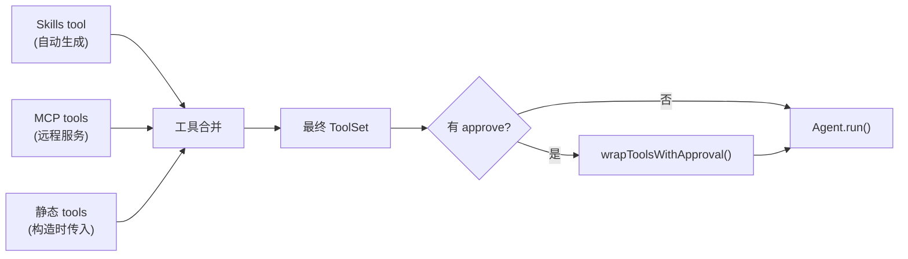
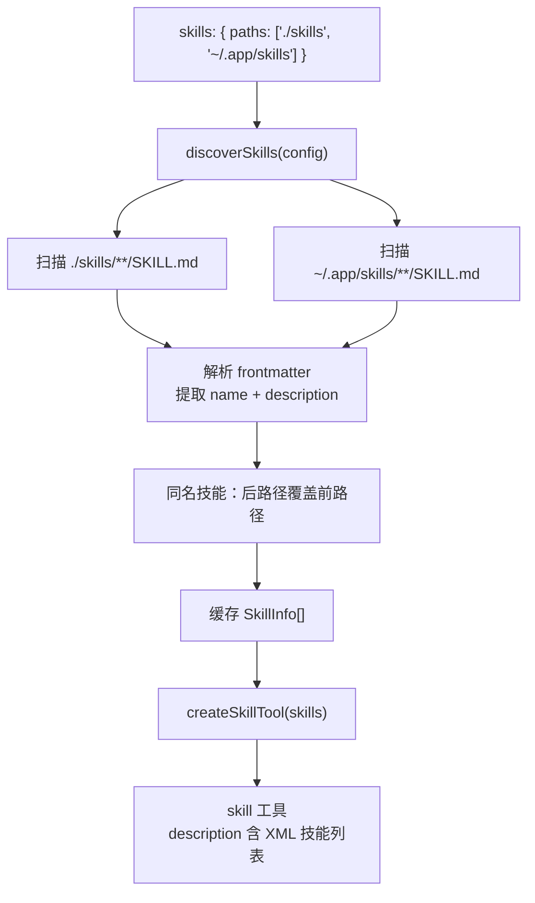
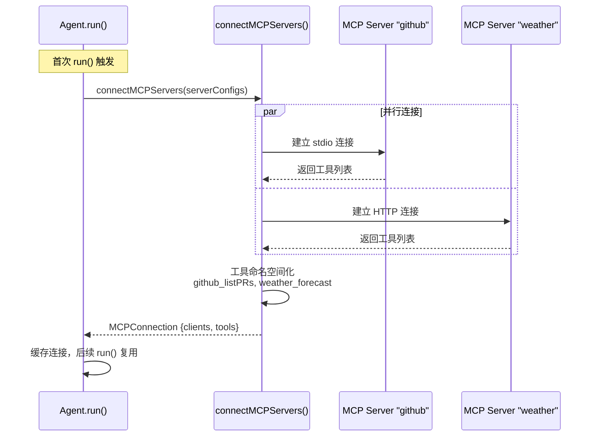
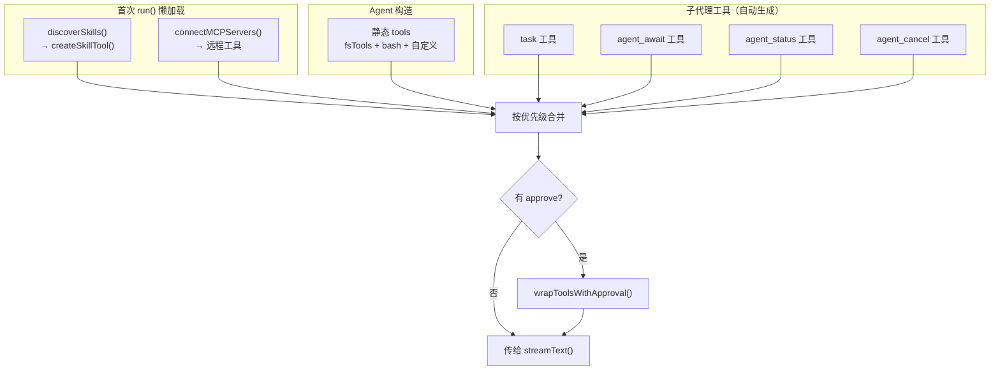

# 第五章 工具系统与扩展

> **读完本章你将获得：** 对 OpenHarness 三套扩展机制的完整理解——内置工具（文件系统 / bash）、Skills 知识注入、MCP Server 集成，以及它们如何在 Agent 中统一融合。

---

## 5.1 工具系统概览

OpenHarness 的工具系统基于 Vercel AI SDK 的 `tool()` 原语。一个工具 = Zod schema 描述 + `execute()` 执行函数。Agent 从三个来源收集工具，按优先级合并：



同名工具按合并顺序：后添加的覆盖先添加的（静态 tools 优先级最高）。

---

## 5.2 内置文件系统工具

六个文件操作工具，导出为独立函数和 `fsTools` 集合：

| 工具 | 输入 | 输出 | 特性 |
|------|------|------|------|
| `readFile` | `path`, `offset?`, `limit?` | 文件内容（按行） | 支持行号偏移和限制 |
| `writeFile` | `path`, `content` | 成功消息 | 自动创建父目录 |
| `editFile` | `path`, `oldText`, `newText`, `replaceAll?` | 成功消息 | 精确字符串替换 |
| `listFiles` | `path`, `recursive?` | 文件/目录列表 | 可选递归 |
| `grep` | `pattern`, `path?`, `include?` | 匹配行及文件名 | 正则搜索，跳过 node_modules/.git |
| `deleteFile` | `path`, `recursive?` | 成功消息 | 支持递归删除目录 |

```
调用路径：src/tools/fs.ts → 导出 readFile / writeFile / editFile / listFiles / grep / deleteFile / fsTools
```

---

## 5.3 Bash 工具

执行任意 shell 命令：

| 参数 | 类型 | 默认值 | 范围 |
|------|------|--------|------|
| `command` | `string` | — | 必需 |
| `timeout` | `number` | `30,000` ms | 1,000 ~ 300,000 ms |

执行方式：`bash -c "${command}"` 在 `process.cwd()` 下运行。

**输出截断策略：**
- stdout 最大 50,000 字符
- stderr 最大 10,000 字符
- 超出部分截断并附加 `[truncated]` 标记

返回值：`{ stdout, stderr, exitCode }`

```
调用路径：src/tools/bash.ts → 导出 bash / bashTools
```

---

## 5.4 Skills：按需知识注入

### 什么是 Skill

Skill 是一个包含 `SKILL.md` 文件的目录——一个 Markdown 知识包。模型通过自动生成的 `skill` 工具按需加载。

**类比：** 如果工具是 Agent 的"手"（执行动作），Skill 就是 Agent 的"参考书"（注入知识上下文）。

### 目录结构

```
my-skills/
├── code-review/
│   ├── SKILL.md              ← 必需：技能定义
│   └── references/
│       └── checklist.md      ← 可选：辅助文件
└── git-workflow/
    ├── SKILL.md
    └── scripts/
        └── rebase.sh
```

### SKILL.md 格式

```yaml
---
name: code-review          # 必需：小写字母数字+连字符
description: 代码审查流程和标准
---

# Code Review

这里是完整的 Markdown 内容...
```

名称规则：`^[a-z0-9]+(-[a-z0-9]+)*$`

### 发现与加载流程



### skill 工具执行

当 LLM 调用 `skill({name: "code-review"})` 时：

1. 在缓存中查找匹配的 `SkillInfo`
2. 返回结构化输出：
   - `<skill_content>` 包含 Markdown 正文
   - `<auxiliary_files>` 列出辅助文件（最多 10 个）
   - `<base_directory>` 技能目录路径
3. LLM 可用 `readFile` 工具读取辅助文件

```
调用路径：src/skills.ts::discoverSkills() + src/tools/skill.ts::createSkillTool()
```

---

## 5.5 MCP Server 集成

### 什么是 MCP

MCP（Model Context Protocol）是一个开放标准，定义了 LLM 应用如何连接外部工具和数据源。OpenHarness 支持连接 MCP 服务器，将远程工具无缝融入 Agent 工具集。

### 三种传输方式

| 类型 | 场景 | 通信方式 |
|------|------|---------|
| `stdio` | 本地服务器 | 子进程 stdin/stdout |
| `http` | 远程服务器 | Streamable HTTP |
| `sse` | 远程服务器（遗留） | Server-Sent Events |

### 连接流程



### 工具命名空间

- **单个 MCP 服务器**：工具名保持原样（如 `listPRs`）
- **多个 MCP 服务器**：自动加前缀（如 `github_listPRs`、`weather_forecast`）

### 清理

```typescript
// Agent.close() 内部调用
await closeMCPClients(this.mcpConnection?.clients);
```

每个 MCP 客户端的 `close()` 方法被调用，释放 stdio 子进程或 HTTP 连接。

```
调用路径：src/mcp.ts::connectMCPServers() / closeMCPClients() / buildTransport()
```

---

## 5.6 自定义工具

任何符合 AI SDK `tool()` 签名的工具都能直接使用：

```typescript
const myTool = tool({
  description: "做某件有用的事",
  inputSchema: z.object({ query: z.string() }),
  execute: async ({ query }) => {
    return { result: `处理了: ${query}` };
  },
});
```

工具通过 Agent 构造参数的 `tools` 属性传入。支持在一个 Agent 中混合使用内置工具、自定义工具、MCP 工具和 Skills。

---

## 5.7 工具在 Agent 中的统一融合



**合并优先级**（后者覆盖前者）：
1. Skill tool
2. MCP tools
3. 静态 tools + 子代理工具

---

### 质检报告

**完整性**
- [x] 内置文件系统工具 6 个全覆盖
- [x] Bash 工具配置和截断策略
- [x] Skills 完整生命周期：结构、发现、加载、执行
- [x] MCP 三种传输、连接流程、命名空间、清理
- [x] 自定义工具指南
- [x] 工具统一融合流程图

**准确性**
- [x] 工具参数和返回值与 fs.ts / bash.ts 源码一致
- [x] Skill 名称正则与 skills.ts 一致
- [x] MCP 命名空间逻辑与 mcp.ts 一致

**可读性**
- [x] 从内置工具 → Skills → MCP → 自定义 → 统一融合递进
- [x] Skills 用类比解释
- [x] 引用 Ch3 的懒加载概念

**勘误建议**
- 无
