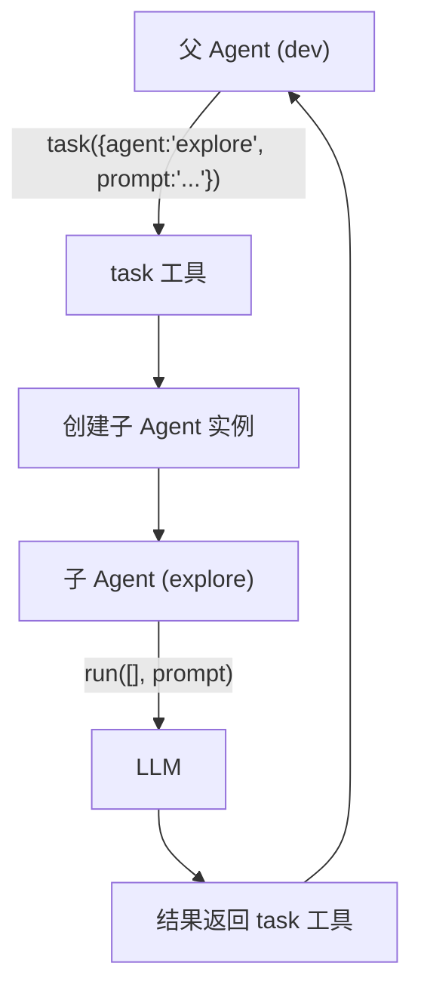
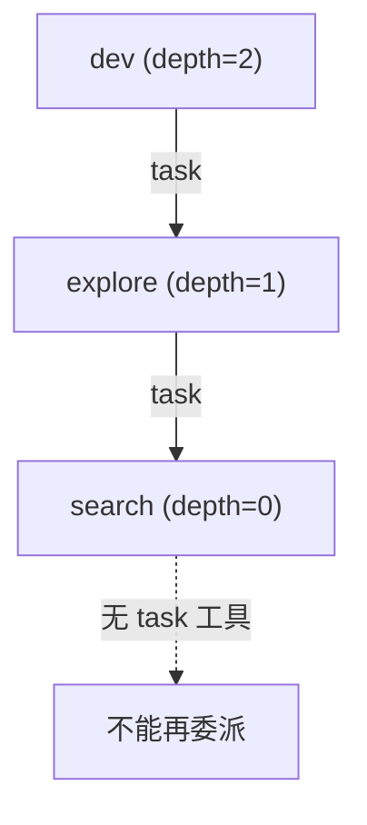
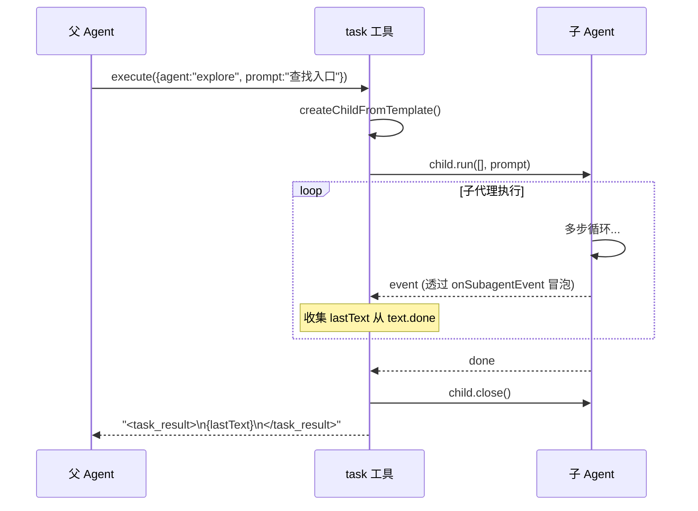
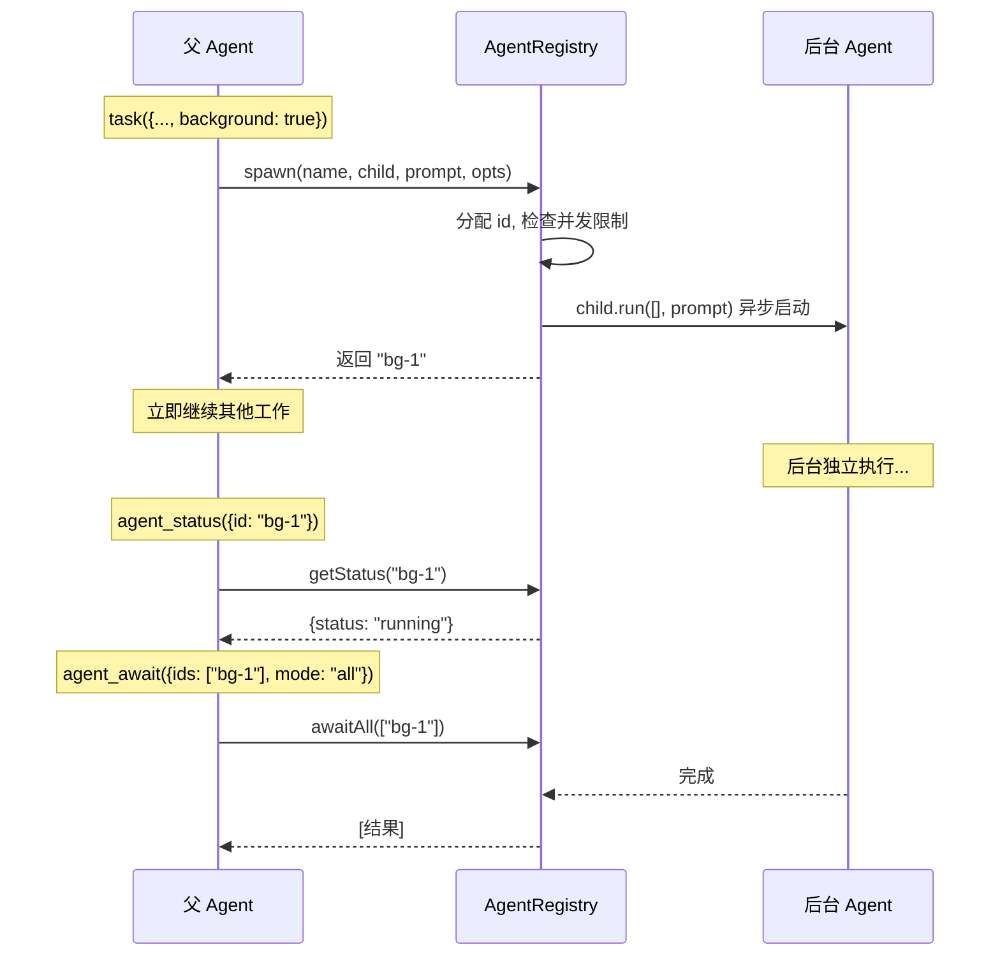
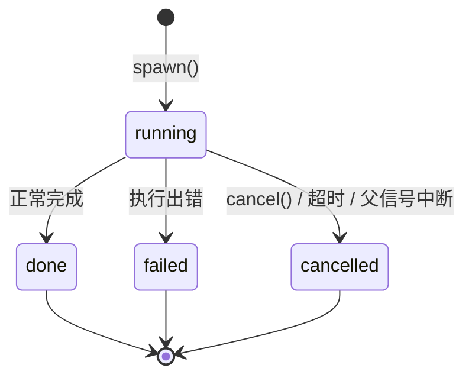
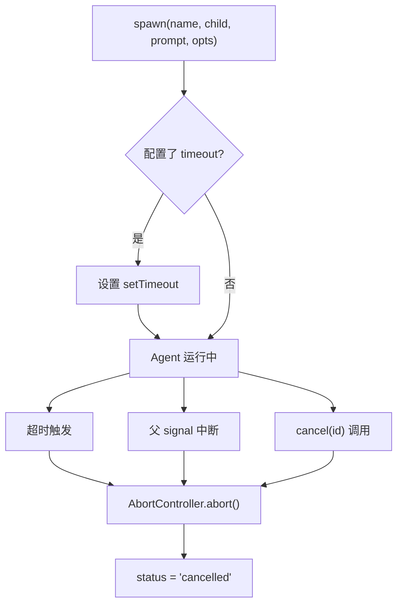
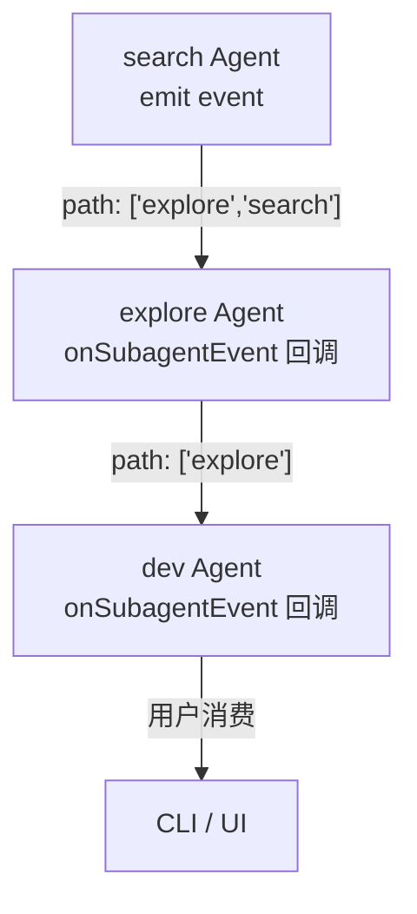

# 第六章 子代理系统

> **读完本章你将获得：** 对 OpenHarness 子代理委派机制的完整理解——task 工具自动生成、深度递减控制、前台/后台两种执行模式、AgentRegistry 的 Promise 组合器语义，以及事件如何在嵌套代理间冒泡。

---

## 6.1 子代理是什么

子代理让一个 Agent 把特定任务委派给另一个专门的 Agent。父 Agent 通过调用自动生成的 `task` 工具来发起委派。

**类比：** 一个技术主管（父 Agent）把"搜索代码库"分配给一个只读助手（子 Agent），助手独立完成后把结果汇报回来。



---

## 6.2 task 工具自动生成

当 Agent 构造参数包含 `subagents` 时，系统自动生成一个 `task` 工具。

### 生成逻辑

```
Agent 构造({subagents: [explore, coder]})
  → 构建模板 Map：{"explore" → template, "coder" → template}
  → createTaskTool(templates, maxSubagentDepth, onSubagentEvent, registry?)
  → 生成 task 工具，description 包含子代理列表
```

task 工具的 description 自动包含可用子代理列表：
```
Available agents:
- explore: Read-only codebase exploration
- coder: Code editing and refactoring
```

### 输入 Schema

```typescript
{
  agent: z.enum(["explore", "coder"]),  // 可用子代理名称
  prompt: z.string(),                    // 任务描述
  background?: z.boolean(),             // 仅当 registry 存在时
}
```

---

## 6.3 深度递减机制

子代理嵌套通过 `maxSubagentDepth` 参数控制，每层递减 1：



| 层级 | Agent | 有效深度 | 能否委派 |
|------|-------|---------|---------|
| Root | dev | 2 | ✅ 可以委派给 explore |
| 子 | explore | 1 | ✅ 可以委派给 search |
| 孙 | search | 0 | ❌ 无 task 工具 |

### createChildFromTemplate

```
createChildFromTemplate(template, remainingDepth, onSubagentEvent)
  1. 用 template 配置创建新 Agent 实例
  2. 不传 approve（子代理自主执行）
  3. 如果 remainingDepth > 0：
     - 保留 template 的 subagents 配置
     - maxSubagentDepth = remainingDepth
     - 包装 onSubagentEvent 加上当前 agent 名到 path
  4. 如果 remainingDepth == 0：
     - 不注入 subagents（无 task 工具）
```

---

## 6.4 前台执行（同步模式）

默认模式。父 Agent 阻塞等待子 Agent 完成后继续。



**关键特征：**
- 空历史启动：`child.run([], prompt)` — 每次 task 调用全新实例
- 结果提取：只保留最后的 `text.done` 文本
- 生命周期管理：完成后调用 `child.close()` 释放资源

---

## 6.5 后台执行（异步模式）

启用 `subagentBackground` 后解锁。父 Agent 可以启动后台子代理、继续其他工作、最后收集结果。

### 启用方式

```typescript
// 简单启用（使用默认值）
subagentBackground: true

// 精细控制
subagentBackground: {
  maxConcurrent: 3,        // 最大并发后台 Agent
  timeout: 120_000,        // 自动取消超时
  autoCancel: true,        // close() 时取消所有后台 Agent
  tools: {
    status: true,          // 注册 agent_status 工具
    cancel: true,          // 注册 agent_cancel 工具
    await: ["all", "race"],// 暴露的 await 模式
  },
}
```

### 后台工作流



---

## 6.6 AgentRegistry 详解

AgentRegistry 是后台子代理的生命周期管理器。它维护一个 `Map<string, RegistryEntry>`，每个 entry 包含 Agent 的 Promise、AbortController 和状态。

### 状态模型



### 四种 Await 模式

与 JavaScript Promise 组合器的对应关系：

| 模式 | JS 等价 | 行为 | 失败处理 |
|------|---------|------|---------|
| `all` | `Promise.all()` | 等全部成功 | 任一失败 → 立即失败 |
| `allSettled` | `Promise.allSettled()` | 等全部结束 | 收集 `{status, result?, error?}` |
| `any` | `Promise.any()` | 首个成功 | 全部失败 → 失败 |
| `race` | `Promise.race()` | 首个结束 | 第一个出结果（含失败） |

### 超时与取消



### 清理

```typescript
// Agent.close() 内部
if (autoCancel) {
  registry.cancelAll();  // 取消所有 running 状态的后台 Agent
}
```

---

## 6.7 事件冒泡

子代理的事件通过 `onSubagentEvent` 回调向上冒泡。回调携带祖先链 `path: string[]`，表示从外到内的代理名称。



嵌套场景下的 path 示例：

| 发起者 | 接收者 | path |
|--------|--------|------|
| explore | dev | `["explore"]` |
| search（explore 的子代理） | dev | `["explore", "search"]` |

回调接收 `AgentEvent`，消费者可据此在 UI 中展示嵌套代理的实时状态。

---

## 6.8 自动生成的工具总览

当 `subagents` + `subagentBackground` 都配置时，Agent 自动注入四个工具：

| 工具 | 触发条件 | 用途 | 阻塞？ |
|------|---------|------|--------|
| `task` | 有 subagents | 委派任务（前台或后台） | 前台阻塞，后台立即返回 |
| `agent_status` | subagentBackground.tools.status | 查询后台 Agent 状态 | 否 |
| `agent_cancel` | subagentBackground.tools.cancel | 取消后台 Agent | 否 |
| `agent_await` | subagentBackground.tools.await | 等待后台 Agent 完成 | 是 |

LLM 自然地通过工具调用来编排子代理——它不需要知道底层的 AgentRegistry API，只需调用工具即可。

---

### 质检报告

**完整性**
- [x] task 工具自动生成逻辑
- [x] 深度递减机制有图解
- [x] 前台执行完整时序
- [x] 后台执行完整时序
- [x] AgentRegistry 状态模型和四种 await 模式
- [x] 超时与取消机制
- [x] 事件冒泡和 path 机制
- [x] 四个自动生成工具总览

**准确性**
- [x] 深度递减逻辑与 createChildFromTemplate 一致
- [x] AgentRegistry 状态与 agent-registry.ts 一致
- [x] 四种 await 模式语义与 Promise 组合器一致

**可读性**
- [x] 从"是什么"→ 自动生成 → 深度控制 → 前台 → 后台 → Registry → 事件冒泡递进
- [x] 类比帮助理解概念
- [x] 引用 Ch3 的工具融合机制

**勘误建议**
- 无
