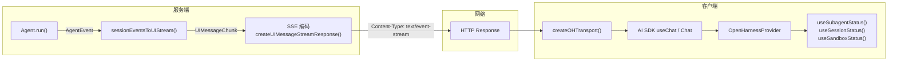
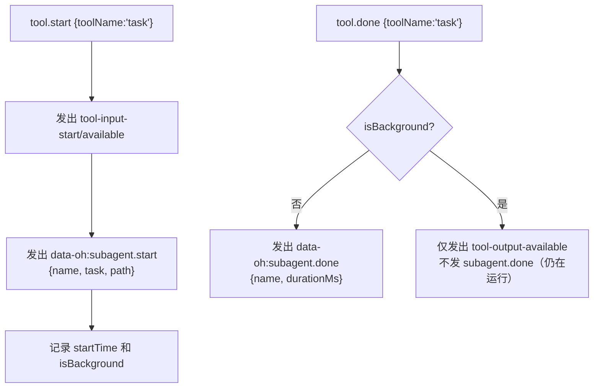
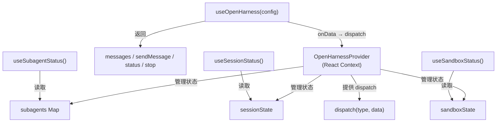

# 第七章 UI 集成层

> **读完本章你将获得：** 对 OpenHarness 如何将 Agent 事件流转换为 AI SDK 5 的 UIMessage 协议、通过 SSE 推送到浏览器、以及 React/Vue 两套客户端适配层的完整理解。

---

## 7.1 UI 集成的整体架构



核心转换链：
```
AgentEvent → sessionEventsToUIStream() → UIMessageChunk → SSE 编码 → HTTP → 客户端解析 → React/Vue 状态
```

---

## 7.2 sessionEventsToUIStream：核心转换器

这是整个 UI 集成的核心函数（`ui-stream.ts`），把 `SessionEvent` 异步流转换为 AI SDK 5 的 `ReadableStream<UIMessageChunk>`。

### 转换规则

| SessionEvent | UIMessageChunk | 说明 |
|---|---|---|
| `text.delta` | `text-start` (首次) + `text-delta` | 文本流式推送 |
| `text.done` | `text-end` | 结束文本部分 |
| `reasoning.delta` | `reasoning-start` (首次) + `reasoning-delta` | 思维链推送 |
| `reasoning.done` | `reasoning-end` | 结束推理部分 |
| `tool.start` | `tool-input-start` + `tool-input-available` | 工具调用开始 |
| `tool.done` | `tool-output-available` | 工具结果 |
| `tool.error` | `tool-output-error` | 工具错误 |
| `step.start` | `start-step` | 步骤开始 |
| `step.done` | `finish-step` | 步骤结束 |
| `done` | `finish` | 执行完成 |
| `error` | `error` | 错误 |

### 子代理事件特殊处理

当 `tool.start` 的 `toolName` 是 `task` 时，转换器额外发出自定义数据部件：



### Session 生命周期事件映射

| SessionEvent | 自定义数据部件 |
|---|---|
| `turn.start` | `data-oh:turn.start` {turnIndex} |
| `turn.done` | `data-oh:turn.done` {turnIndex} |
| `compaction.start` | `data-oh:session.compacting` + `data-oh:compaction.start` |
| `compaction.done` | `data-oh:compaction.done` {messagesRemoved} |
| `compaction.pruned` | `data-oh:compaction.done` {messagesRemoved} |
| `retry` | `data-oh:retry` {attempt, reason, delayMs} |
| `compaction.summary` | **静默消费，不发出** |

---

## 7.3 自定义数据部件类型系统

OpenHarness 定义了一套自定义数据部件类型（`types/ui-message.ts` + `types/stream-parts.ts`），用于在 SSE 流中传递 Agent 特有的状态信息。

### OHDataTypes

```typescript
type OHDataTypes = {
  "oh:subagent.start": { name: string; task: string; path: string[] };
  "oh:subagent.done":  { name: string; durationMs: number };
  "oh:subagent.error": { name: string; error: string };
  "oh:compaction.start": { reason: string; tokensBefore: number };
  "oh:compaction.done":  { messagesRemoved: number };
  "oh:retry":            { attempt: number; reason: string; delayMs: number };
  "oh:turn.start":       { turnIndex: number };
  "oh:turn.done":        { turnIndex: number; durationMs: number };
  "oh:session.compacting": {};
};
```

### 类型守卫

```typescript
isOHDataPart(part)          // type 以 "data-oh:" 开头
isSubagentEvent(part)       // subagent.start/done/error
isCompactionEvent(part)     // compaction.start/done
isRetryEvent(part)          // retry
isSessionLifecycleEvent(part) // turn.start/done, session.compacting
```

### OHMetadata

每条 UIMessage 可携带的元数据：

```typescript
type OHMetadata = {
  agentName?: string;
  sessionId?: string;
  turnIndex?: number;
  wasCompacted?: boolean;
};
```

---

## 7.4 SSE 格式化器

`stream-parts.ts` 导出一组 SSE 格式化函数，负责将 UIMessageChunk 编码为 SSE 文本行：

| 函数 | 用途 |
|------|------|
| `formatSSE(data)` | 通用 SSE 编码：`data: ${JSON.stringify(data)}\n\n` |
| `formatTextDelta(text)` | 文本增量 |
| `formatReasoningDelta(text)` | 推理增量 |
| `formatToolStart/Result/Error` | 工具生命周期 |
| `formatStepStart/Finish` | 步骤边界 |
| `formatDataPart(type, data)` | 自定义数据部件 |
| `formatFinishMessage(reason)` | 完成信号 |
| `formatDone()` | 流结束标记 |

---

## 7.5 服务端入口：toResponse()

`Session` 和 `Conversation` 都提供两个方法：

| 方法 | 返回值 | 用途 |
|------|--------|------|
| `toUIMessageStream(input)` | `ReadableStream<UIMessageChunk>` | 供自定义处理 |
| `toResponse(input, init)` | `Response` | 直接返回给 HTTP 请求 |

`toResponse()` 的内部流程：

```
toResponse(input, {signal, ...init})
  → toUIMessageStream(input, {signal})
    → sessionEventsToUIStream(this.send(input), {signal})
  → createUIMessageStreamResponse(stream, init)
    → new Response(stream, {
         headers: { "Content-Type": "text/event-stream", ... }
       })
```

---

## 7.6 React 适配层（@openharness/react）

### 组件/Hook 架构



### OpenHarnessProvider

无渲染 Context Provider，管理三类状态并提供 `dispatch` 回调。

dispatch 处理的事件类型：

| 事件 | 状态变更 |
|------|---------|
| `data-oh:subagent.start` | 向 subagents Map 添加 entry |
| `data-oh:subagent.done` | 更新 status='done', 设置 durationMs |
| `data-oh:subagent.error` | 更新 status='error', 设置 error |
| `data-oh:turn.start` | 设置 currentTurn |
| `data-oh:turn.done` | 更新 currentTurn |
| `data-oh:compaction.start` | 设置 isCompacting=true |
| `data-oh:compaction.done` | 设置 isCompacting=false, 记录 lastCompactionAt |
| `data-oh:retry` | 设置 isRetrying=true, 记录 attempt/reason |
| `data-oh:sandbox.provisioning` | 设置 isProvisioning=true |
| `data-oh:sandbox.ready` | 设置 isWarm=true |

### useOpenHarness(config)

主 Hook，包装 AI SDK 5 的 `useChat`：

- 预配置 `createOHTransport()` 连接到 endpoint
- `onData` 事件路由到 Provider 的 `dispatch`
- 支持 message hydration（从持久化恢复历史消息）
- 返回 `UseChatHelpers<OHUIMessage>`

### 派生状态 Hooks

| Hook | 返回值 | 数据来源 |
|------|--------|---------|
| `useSubagentStatus()` | activeSubagents, recentSubagents, hasActiveSubagents | subagents Map 的 useMemo 派生 |
| `useSessionStatus()` | SessionState 对象 | 直接返回 context.sessionState |
| `useSandboxStatus()` | SandboxState 对象 | 直接返回 context.sandboxState |

---

## 7.7 Vue 适配层（@openharness/vue）

### 与 React 的结构对照

| 概念 | React | Vue |
|------|-------|-----|
| 上下文机制 | `React.createContext` + `useContext` | `provide` / `inject` |
| 响应式状态 | `useState` + `useCallback` | `ref()` |
| 派生计算 | `useMemo` | `computed()` |
| Provider | JSX 组件 | `defineComponent` (renderless) |
| 主 Hook | `useOpenHarness()` 包装 `useChat` | `useOpenHarness()` 实例化 `Chat` 类 |

### 关键差异

1. **Chat 实例化**：React 用 `useChat` hook，Vue 直接 `new Chat()`
2. **Message hydration**：React 已实现，Vue 尚未实现
3. **状态更新**：React 用 setState 不可变更新，Vue 直接修改 `.value`

### Composables

| Composable | 返回值 |
|-----------|--------|
| `useOpenHarness(config)` | `Chat<OHUIMessage>` 实例 |
| `useSubagentStatus()` | `ComputedRef<SubagentStatusResult>` |
| `useSessionStatus()` | `ComputedRef<SessionState>` |
| `useSandboxStatus()` | `ComputedRef<SandboxState>` |

---

## 7.8 Transport 层

React 和 Vue 共享相同的 transport 实现——`createOHTransport()` 包装 AI SDK 的 `DefaultChatTransport`：

```typescript
function createOHTransport(options: OHTransportOptions): ChatTransport<OHUIMessage> {
  return new DefaultChatTransport({
    api: options.endpoint,
    headers: options.headers,
    credentials: options.credentials,
    fetch: options.fetch,
    body: options.body,
  });
}
```

Transport 负责将 `sendMessage` 调用翻译为 HTTP POST 请求，并解析 SSE 响应。

---

### 质检报告

**完整性**
- [x] sessionEventsToUIStream 完整转换规则
- [x] 子代理事件特殊处理逻辑
- [x] 自定义数据部件类型系统
- [x] SSE 格式化器列表
- [x] toResponse() 服务端入口
- [x] React Provider/hooks 完整架构
- [x] Vue composables 完整覆盖
- [x] React vs Vue 差异对照

**准确性**
- [x] 事件映射表与 ui-stream.ts 源码一致
- [x] OHDataTypes 定义与 types/ui-message.ts 一致
- [x] Provider dispatch 事件列表与 provider.tsx 一致

**可读性**
- [x] 从架构概览 → 核心转换器 → 类型系统 → 服务端 → React → Vue 递进
- [x] React 和 Vue 的对照表帮助理解差异
- [x] 引用 Ch2 数据流全景的 Web UI 场景

**勘误建议**
- 无
