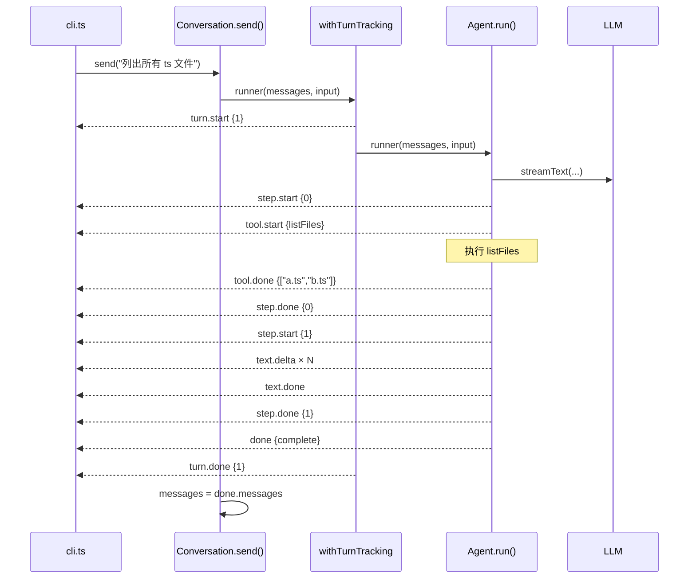
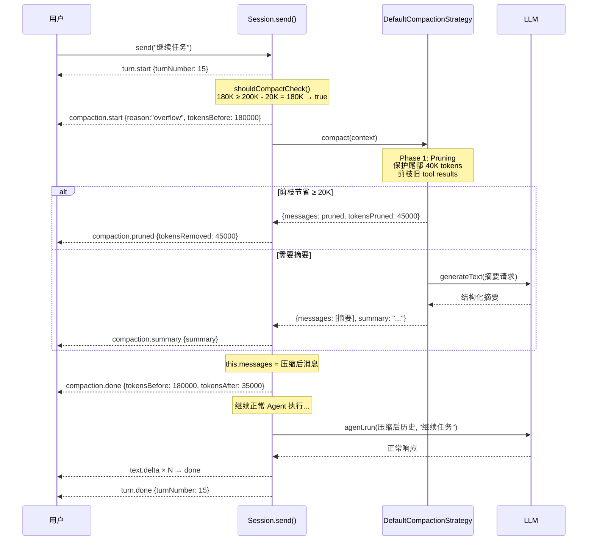

# 第八章 端到端追踪

> **读完本章你将获得：** 三个关键场景的完整代码路径追踪——从触发到结束的每一步都精确到文件和函数。这是全书的验收章节，如果你能跟着走通这三条路径，说明你已经真正理解了 OpenHarness 的全流程。

---

## 8.1 追踪一：CLI 单轮对话

**场景：** 用户在 CLI 输入 "列出所有 ts 文件"，Agent 调用 `listFiles` 工具，返回结果。

### 完整调用路径

```
examples/cli/cli.ts::ask()                          ← 1. 读取用户输入
  → examples/cli/cli.ts::main loop (L203)           ← 2. for await (const event of chat.send(input))
    → packages/core/src/conversation.ts::send()      ← 3. 调用 this.runner(messages, input)
      → packages/core/src/middleware/retry.ts::withRetry()(runner)       ← 4. 重试层：设 hasYieldedContent=false
        → packages/core/src/middleware/compaction.ts::withCompaction()(runner)  ← 5. 压缩层：首次无历史，跳过
          → packages/core/src/middleware/turn-tracking.ts::withTurnTracking()(runner)  ← 6. yield turn.start
            → packages/core/src/agent.ts::Agent.run()                    ← 7. 核心执行循环
              → (懒加载) src/instructions.ts::loadInstructions()         ← 8. 加载 AGENTS.md
              → (懒加载) src/mcp.ts::connectMCPServers()                ← 9. 连接 MCP（如配置）
              → src/agent.ts (L269): streamText({model, messages, tools})  ← 10. 调用 AI SDK
                → LLM HTTP 流式请求                                       ← 11. 发往 LLM Provider
                ← stream.fullStream 产出事件                              ← 12. 接收流式响应
              → yield step.start {stepNumber: 0}                          ← 13. 第一步开始
              → yield tool.start {toolName: "listFiles"}                  ← 14. LLM 决定调用工具
              → (执行 listFiles 工具)                                     ← 15. 工具执行
              → yield tool.done {output: [...]}                           ← 16. 工具完成
              → yield step.done {stepNumber: 0, usage}                    ← 17. 第一步结束
              → yield step.start {stepNumber: 1}                          ← 18. 第二步（基于工具结果生成文本）
              → yield text.delta × N                                      ← 19. 流式文本
              → yield text.done                                           ← 20. 文本完成
              → yield step.done {stepNumber: 1, usage}                    ← 21. 第二步结束
              → yield done {result:"complete", messages, totalUsage}      ← 22. Agent 完成
          ← withTurnTracking: yield turn.done {turnNumber: 1}            ← 23. 轮次结束
        ← withCompaction: 记录 lastInputTokens（从 step.done 提取）      ← 24. 压缩层记录
      ← withRetry: 无错误，透传                                          ← 25. 重试层透传
    ← conversation.ts::send(): this.messages = event.messages            ← 26. 更新消息历史
  ← cli.ts: switch(event.type) 打印文本 / 显示工具调用                    ← 27. 用户看到结果
```

### 关键文件索引

| 步骤 | 文件 | 函数 | 行号 |
|------|------|------|------|
| 用户输入 | `examples/cli/cli.ts` | `ask()` | ~27 |
| 中间件组装 | `examples/cli/cli.ts` | (模块级) | ~174-179 |
| 事件消费循环 | `examples/cli/cli.ts` | (main loop) | ~203-292 |
| Conversation.send | `packages/core/src/conversation.ts` | `send()` | ~34-44 |
| 重试中间件 | `packages/core/src/middleware/retry.ts` | `withRetry()` | ~21-86 |
| 压缩中间件 | `packages/core/src/middleware/compaction.ts` | `withCompaction()` | ~28-105 |
| 轮次追踪 | `packages/core/src/middleware/turn-tracking.ts` | `withTurnTracking()` | ~9-38 |
| Agent 执行 | `packages/core/src/agent.ts` | `run()` | ~224-350 |
| 事件显示 | `examples/cli/cli.ts` | (switch) | ~204-291 |

### 事件序列时间线



---

## 8.2 追踪二：Next.js 流式请求

**场景：** 用户在浏览器输入 "你好"，消息通过 SSE 流式返回。

### 完整调用路径

```
=== 客户端 ===
nextjs-demo/app/components/chat-view.tsx::handleSubmit()        ← 1. 用户点击发送
  → @openharness/react::useOpenHarness()::sendMessage({text})   ← 2. 调用 AI SDK sendMessage
    → @openharness/react::transport.ts::createOHTransport()      ← 3. POST /api/chat {id, messages}

=== 网络 ===
  → HTTP POST /api/chat                                          ← 4. 请求到达服务端

=== 服务端 ===
nextjs-demo/app/api/chat/route.ts::POST(req)                    ← 5. 路由处理函数
  → const { id, messages } = await req.json()                    ← 6. 解析请求体
  → route.ts::getOrCreateConversation(id)                        ← 7. 获取或创建 Conversation
    → packages/core/src/runner.ts::apply(toRunner(agent), ...)   ← 8. 中间件管道组装
  → packages/core/src/messages.ts::extractUserInput(messages)    ← 9. 提取最后一条用户消息
  → packages/core/src/conversation.ts::toResponse(input, {signal}) ← 10. 创建 SSE 响应
    → conversation.ts::toUIMessageStream(input)                   ← 11. 创建 UI 流
      → packages/core/src/ui-stream.ts::sessionEventsToUIStream() ← 12. 核心转换函数
        → conversation.ts::send(input)                             ← 13. 启动中间件管道
          → middleware 管道 → Agent.run() → streamText() → LLM    ← 14. 执行循环
          ← AgentEvent 事件流                                     ← 15. 事件流返回

        → ui-stream.ts: 映射 text.delta → text-start + text-delta ← 16. 事件转换为 UIMessageChunk
        → ui-stream.ts: 映射 done → finish chunk                  ← 17. 完成信号
    → AI SDK: createUIMessageStreamResponse(stream)               ← 18. 包装为 HTTP Response
  ← return Response {Content-Type: text/event-stream}             ← 19. SSE 响应返回

=== 网络 ===
  ← SSE 流推送到客户端                                             ← 20. 浏览器接收 SSE

=== 客户端 ===
@ai-sdk/react::useChat()                                         ← 21. AI SDK 解析 SSE
  → 更新 messages 响应式状态                                       ← 22. React 状态更新
  → onData(dataPart) → Provider.dispatch()                        ← 23. 自定义数据部件分发
    → Provider 更新 subagentState / sessionState                   ← 24. 派生状态更新
  → React 重渲染                                                  ← 25. UI 刷新
    → chat-view.tsx 渲染 messages                                  ← 26. 消息展示
    → status-bar.tsx 渲染状态                                      ← 27. 状态栏更新
```

### 关键文件索引

| 阶段 | 文件 | 函数 | 行号 |
|------|------|------|------|
| 发送消息 | `examples/nextjs-demo/app/components/chat-view.tsx` | `handleSubmit()` | ~80-91 |
| POST 处理 | `examples/nextjs-demo/app/api/chat/route.ts` | `POST()` | ~100-106 |
| Conversation 创建 | `examples/nextjs-demo/app/api/chat/route.ts` | `getOrCreateConversation()` | ~79-96 |
| 输入提取 | `packages/core/src/messages.ts` | `extractUserInput()` | ~10-31 |
| 响应创建 | `packages/core/src/conversation.ts` | `toResponse()` | ~78-87 |
| UI 流生成 | `packages/core/src/conversation.ts` | `toUIMessageStream()` | ~67-72 |
| 事件转换 | `packages/core/src/ui-stream.ts` | `sessionEventsToUIStream()` | ~13-326 |
| Hook 消费 | `packages/react/src/hooks/use-open-harness.ts` | `useOpenHarness()` | ~35-58 |
| 状态派发 | `packages/react/src/provider.tsx` | `dispatch()` | (内部) |

### 数据变换链可视化

```mermaid
flowchart LR
    A["用户文本<br/>'你好'"] -->|sendMessage| B["UIMessage[]<br/>{role:'user', parts:[{type:'text'}]}"]
    B -->|HTTP POST| C["req.json()<br/>{id, messages}"]
    C -->|extractUserInput| D["string<br/>'你好'"]
    D -->|Agent.run| E["AgentEvent 流<br/>text.delta / done"]
    E -->|sessionEventsToUIStream| F["UIMessageChunk 流<br/>text-start / text-delta / finish"]
    F -->|SSE 编码| G["HTTP Response<br/>data: {...}\\n\\n"]
    G -->|浏览器解析| H["OHUIMessage[]<br/>React 状态更新"]
```



---

## 8.3 追踪三：Compaction 触发的长对话

**场景：** 经过多轮对话后，上下文接近 200K tokens。用户发送新消息，触发自动 Compaction。

### 完整调用路径

```
Session.send(input)                                            ← 1. 用户发送新消息
  → this._turns++                                              ← 2. 轮次递增
  → yield { type: "turn.start", turnNumber }                   ← 3. 轮次开始事件
  
  → this.shouldCompactCheck()                                  ← 4. 检查是否需要压缩
    → session.ts (~L565):
      lastInputTokens(180,000) ≥ contextWindow(200,000) - reservedTokens(20,000)  
      → 180,000 ≥ 180,000 → true                              ← 5. 触发！

  → yield* this.compact({signal})                              ← 6. 进入压缩生成器
    → session.ts::compact() (~L478)                            
    → defaultEstimateTokens(this.messages)                     ← 7. 估算当前 tokens
    → yield { type: "compaction.start", reason:"overflow", tokensBefore: 180000 }  ← 8.

    → this.compactionStrategy.compact(context)                 ← 9. 调用压缩策略
      → session.ts::DefaultCompactionStrategy.compact() (~L178)
      
      === Phase 1: Pruning ===
      → pruneToolResults(messages, protectedTokens=40000)       ← 10.
        → session.ts::pruneToolResults() (~L241)
        → 从尾部向前累积 token：
          messages[N] → messages[N-1] → ... → messages[K]       ← 11. 找到保护边界 K
          (累积至 ≥ 40,000 tokens 时设 boundary = K)
        → 从头到 boundary 遍历：
          对 role="tool" 的消息，替换 result 为 "[pruned]"        ← 12. 剪枝
      
      → 检查 tokensSaved ≥ minPruneSavings(20,000)?
      
      alt 剪枝节省充足
        ← 返回 {messages: pruned, tokensPruned}                 ← 13a. Phase 1 完成
      else 剪枝不足，进入 Phase 2
        === Phase 2: Summarization ===
        → generateText({                                        ← 13b. 调用 LLM 生成摘要
            model: summaryModel ?? context.model,
            system: DEFAULT_SUMMARY_PROMPT,
            messages: [{role:"user", content: 全部对话文本}]
          })
        ← { text: summary }                                     ← 14. 收到摘要
        → 构建 summaryMessages:
          [{role:"user", content: "[Previous conversation summary]\n{summary}\n[continues]"}]
        ← 返回 {messages: summaryMessages, summary}              ← 15. Phase 2 完成
      end

    → (回到 Session.compact)
    → 如果 tokensPruned > 0:
      yield { type: "compaction.pruned", tokensRemoved, messagesRemoved }  ← 16. 剪枝事件
    → 如果有 summary:
      yield { type: "compaction.summary", summary }              ← 17. 摘要事件
    → this.messages = result.messages                            ← 18. 替换消息历史！
    → tokensAfter = defaultEstimateTokens(this.messages)         ← 19. 重新估算
    → yield { type: "compaction.done", tokensBefore: 180000, tokensAfter: 35000 }  ← 20.

  → (回到 Session.send，继续正常执行)
  → hooks.onBeforeSend?.(this.messages)                         ← 21. 钩子（压缩后的消息）
  → agent.run(this.messages, input)                             ← 22. 用压缩后的历史调用 Agent
    → streamText({...})                                         ← 23. LLM 请求（token 大幅减少）
    ← 正常事件流                                                 ← 24. 执行完成
  → yield done                                                  ← 25.
  → 更新 messages / totalUsage                                  ← 26.
  → yield { type: "turn.done" }                                 ← 27. 轮次结束
```

### Compaction 事件时间线



### 关键文件索引

| 步骤 | 文件 | 函数 | 行号 |
|------|------|------|------|
| 触发检查 | `packages/core/src/session.ts` | `shouldCompactCheck()` | ~550-566 |
| 压缩生成器 | `packages/core/src/session.ts` | `compact()` | ~478-521 |
| 默认策略 | `packages/core/src/session.ts` | `DefaultCompactionStrategy.compact()` | ~178-223 |
| 工具结果剪枝 | `packages/core/src/session.ts` | `pruneToolResults()` | ~241-283 |
| Token 估算 | `packages/core/src/utils.ts` | `defaultEstimateTokens()` | ~53 |

---

## 8.4 全书验收：你现在应该能回答

1. **Agent.run() 产出的事件是如何到达浏览器的？**
   → AgentEvent → sessionEventsToUIStream() → UIMessageChunk → SSE → HTTP → useChat 解析 → React 状态

2. **中间件的执行顺序为什么 apply 列表越前越"外"？**
   → `apply(runner, A, B, C)` = `A(B(C(runner)))`，A 最先收到 runner 的入参，最后收到 runner 的输出

3. **为什么 Retry 只在"无内容产出"时触发？**
   → 工具可能已执行副作用（写文件、bash 命令），重试会重复执行

4. **Compaction 的两阶段为什么先 Pruning 再 Summarization？**
   → Pruning 零 LLM 调用、极快；只有 Pruning 不够时才调用 LLM 生成摘要

5. **子代理的 task 工具为什么每次创建新实例？**
   → 无共享对话状态，避免跨任务状态污染

---

### 质检报告

**完整性**
- [x] 三个端到端场景完整追踪
- [x] 每个场景有调用路径链 + 文件索引表 + Mermaid 图
- [x] 覆盖 CLI / Web / Compaction 三种典型场景
- [x] 全书验收问题帮助读者自测

**准确性**
- [x] 文件路径和函数名与源码一致
- [x] 行号为近似值，指向正确的代码区域
- [x] Compaction 公式 `lastInputTokens ≥ contextWindow - reservedTokens` 与源码一致

**可读性**
- [x] 每个追踪从触发到结束完整线性展开
- [x] 调用路径链用缩进表示层级
- [x] 同时有文字路径和 Mermaid 图双重表达

**勘误建议**
- 无
